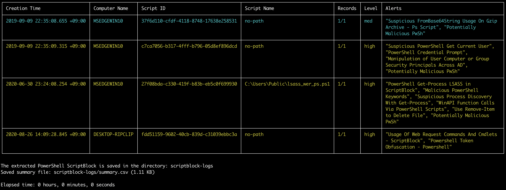
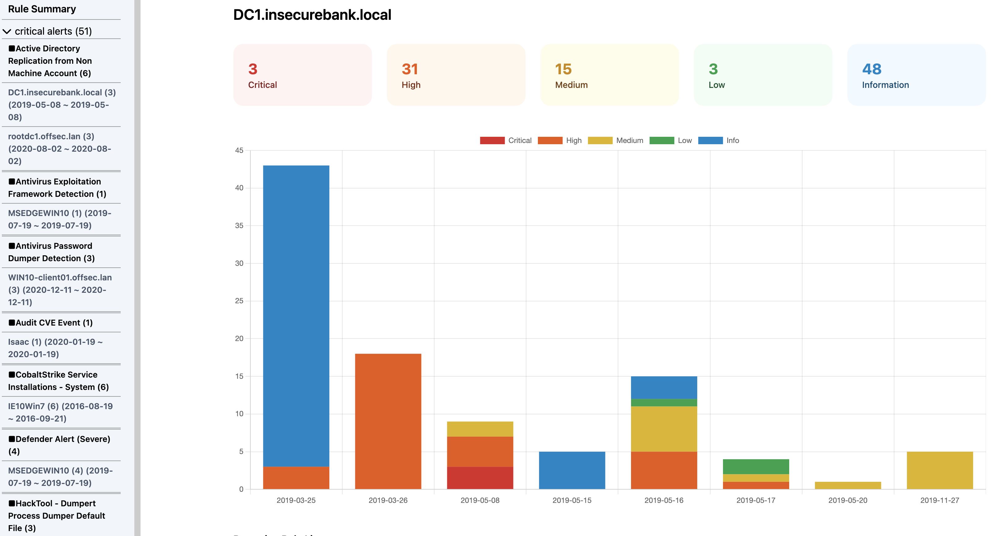
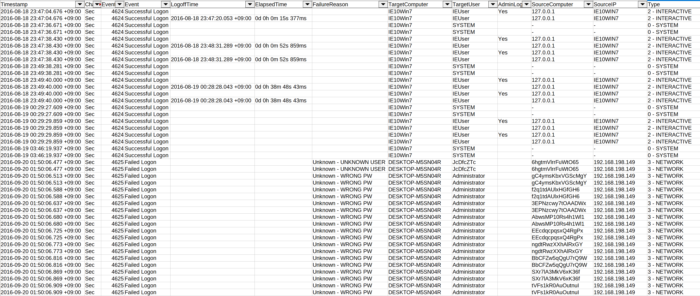

<div align="center">
 <p>
     
 </p>
 [ <a href="README.md"><b>English</b></a> ] | [ 日本語 ]
</div>

---

<p align="center">
    <a href="https://github.com/Yamato-Security/takajo/releases"></a>
    <a href="https://github.com/Yamato-Security/takajo/releases"></a>
    <a href="https://github.com/Yamato-Security/takajo/stargazers"></a>
    <a href="https://codeblue.jp/2022/en/talks/?content=talks_24"></a>
    <a href="https://www.seccon.jp/2022/seccon_workshop/windows.html"></a>
    <a href="https://www.sans.org/cyber-security-training-events/digital-forensics-summit-2023/"></a>
    <a href="https://bsides.tokyo/2024/"></a>
    <a href="https://www.hacker.or.jp/hack-fes-2024/"></a>
    <a href="https://hitcon.org/2024/CMT/"></a>
    <a href="https://www.blackhat.com/sector/2024/briefings/schedule/index.html#performing-dfir-and-threat-hunting-with-yamato-security-oss-tools-and-community-driven-knowledge-41347"></a>
    <a href=""></a>
    <a href="https://twitter.com/SecurityYamato"></a>
</p>

## Takajoについて

Takajō (鷹匠)は 日本の[Yamato Security](https://yamatosecurity.connpass.com/)グループによって作られた [Hayabusa](https://github.com/Yamato-Security/hayabusa)から得られた結果を解析するツールです。Takajōは[Nim](https://nim-lang.org/)で作られました。
Takajōは、日本語で["鷹狩りのスキルに優れた人"](https://en.wikipedia.org/wiki/Falconry)を意味し、ハヤブサの「獲物」（結果）を分析することから選ばれました。

# 関連プロジェクト

* [EnableWindowsLogSettings](https://github.com/Yamato-Security/EnableWindowsLogSettings) - Sigmaベースの脅威ハンティングと、Windowsイベントログのファストフォレンジックタイムライン生成ツール。
* [Hayabusa](https://github.com/Yamato-Security/hayabusa/blob/main/README-Japanese.md) - Windowsイベントログを正しく設定するためのドキュメンテーションとスクリプト。
* [Hayabusa Rules](https://github.com/Yamato-Security/hayabusa-rules/blob/main/README-Japanese.md) - Hayabusaのための検知ルール。
* [Hayabusa Sample EVTXs](https://github.com/Yamato-Security/hayabusa-sample-evtx) - Hayabusa/Sigma検出ルールをテストするためのサンプルevtxファイル。
* [WELA (Windows Event Log Analyzer)](https://github.com/Yamato-Security/WELA/blob/main/README-Japanese.md) - PowerShellで書かれたWindowsイベントログの解析ツール。

## 目次

- [関連プロジェクト](#関連プロジェクト)
  - [目次](#目次)
  - [機能](#機能)
- [ダウンロード](#ダウンロード)
  - [Gitクローン](#gitクローン)
  - [アドバンス: ソースコードからのコンパイル（任意）](#アドバンス-ソースコードからのコンパイル任意)
- [コマンド一覧](#コマンド一覧)
  - [Automationコマンド](#automationコマンド)
  - [Extractコマンド](#extractコマンド)
  - [HTMLコマンド](#htmlコマンド)
  - [Listコマンド](#listコマンド)
  - [Splitコマンド](#splitコマンド)
  - [Stackコマンド](#stackコマンド)
  - [Sysmonコマンド](#sysmonコマンド)
  - [Timelineコマンド](#timelineコマンド)
  - [TTP Commands](#ttp-commands)
  - [VirusTotalコマンド](#virustotalコマンド)
- [コマンド使用方法](#コマンド使用方法)
  - [Automationコマンド](#automationコマンド-1)
    - [`automagic`コマンド](#automagicコマンド)
      - [`automagic`コマンドの使用例](#automagicコマンドの使用例)
  - [Extractコマンド](#extractコマンド-1)
    - [`extract-scriptblocks`コマンド](#extract-scriptblocksコマンド)
      - [`extract-scriptblocks`コマンドの使用例](#extract-scriptblocksコマンドの使用例)
      - [`extract-scriptblocks`スクリーンショット](#extract-scriptblocksスクリーンショット)
  - [HTMLコマンド](#htmlコマンド-1)
    - [`html-report`コマンド](#html-reportコマンド)
      - [`html-report`コマンドの使用例](#html-reportコマンドの使用例)
      - [`html-report`スクリーンショット](#html-reportスクリーンショット)
        - [ルールサマリ](#ルールサマリ)
        - [コンピュータサマリ](#コンピュータサマリ)
        - [ルール一覧](#ルール一覧)
  - [Listコマンド](#listコマンド-1)
    - [`list-domains`コマンド](#list-domainsコマンド)
      - [`list-domains`コマンドの使用例](#list-domainsコマンドの使用例)
    - [`list-hashes`コマンド](#list-hashesコマンド)
      - [`list-hashes`コマンドの使用例](#list-hashesコマンドの使用例)
    - [`list-ip-addresses`コマンド](#list-ip-addressesコマンド)
      - [`list-ip-addresses`コマンドの使用例](#list-ip-addressesコマンドの使用例)
    - [`list-undetected-evtx`コマンド](#list-undetected-evtxコマンド)
      - [`list-undetected-evtx`コマンドの使用例](#list-undetected-evtxコマンドの使用例)
    - [`list-unused-rules`コマンド](#list-unused-rulesコマンド)
      - [`list-unused-rules`コマンドの使用例](#list-unused-rulesコマンドの使用例)
  - [Splitコマンド](#splitコマンド-1)
    - [`split-csv-timeline`コマンド](#split-csv-timelineコマンド)
      - [`split-csv-timeline`コマンドの使用例](#split-csv-timelineコマンドの使用例)
    - [`split-json-timeline`コマンド](#split-json-timelineコマンド)
      - [`split-json-timeline`コマンドの使用例](#split-json-timelineコマンドの使用例)
  - [Stackコマンド](#stackコマンド-1)
    - [`stack-cmdlines`コマンド](#stack-cmdlinesコマンド)
      - [`stack-cmdlines`コマンドの使用例](#stack-cmdlinesコマンドの使用例)
    - [`stack-computers`コマンド](#stack-computersコマンド)
      - [`stack-computers`コマンドの使用例](#stack-computersコマンドの使用例)
    - [`stack-dns`コマンド](#stack-dnsコマンド)
      - [`stack-dns`コマンドの使用例](#stack-dnsコマンドの使用例)
    - [`stack-ip-addresses`コマンド](#stack-ip-addressesコマンド)
      - [`stack-ip-addresses`コマンドの使用例](#stack-ip-addressesコマンドの使用例)
    - [`stack-logons`コマンド](#stack-logonsコマンド)
      - [`stack-logons`コマンドの使用例](#stack-logonsコマンドの使用例)
    - [`stack-processes`コマンド](#stack-processesコマンド)
      - [`stack-processes`コマンドの使用例](#stack-processesコマンドの使用例)
    - [`stack-services`コマンド](#stack-servicesコマンド)
      - [`stack-services`コマンドの使用例](#stack-servicesコマンドの使用例)
    - [`stack-tasks`コマンド](#stack-tasksコマンド)
      - [`stack-tasks`コマンドの使用例](#stack-tasksコマンドの使用例)
    - [`stack-users`コマンド](#stack-usersコマンド)
      - [`stack-users`コマンドの使用例](#stack-usersコマンドの使用例)
  - [Sysmonコマンド](#sysmonコマンド-1)
    - [`sysmon-process-tree`コマンド](#sysmon-process-treeコマンド)
      - [`sysmon-process-tree`コマンドの使用例](#sysmon-process-treeコマンドの使用例)
      - [`sysmon-process-tree`スクリーンショット](#sysmon-process-treeスクリーンショット)
  - [Timelineコマンド](#timelineコマンド-1)
    - [`timeline-logon`コマンド](#timeline-logonコマンド)
      - [`timeline-logon`コマンドの使用例](#timeline-logonコマンドの使用例)
      - [`timeline-logon`スクリーンショット](#timeline-logonスクリーンショット)
    - [`timeline-partition-diagnostic`コマンド](#timeline-partition-diagnosticコマンド)
      - [`timeline-partition-diagnostic`コマンドの使用例](#timeline-partition-diagnosticコマンドの使用例)
    - [`timeline-suspicious-processes`コマンド](#timeline-suspicious-processesコマンド)
      - [`timeline-suspicious-processes`コマンドの使用例](#timeline-suspicious-processesコマンドの使用例)
      - [`timeline-suspicious-processes`スクリーンショット](#timeline-suspicious-processesスクリーンショット)
    - [`timeline-tasks`コマンド](#timeline-tasksコマンド)
      - [`timeline-tasks`コマンドの使用例](#timeline-tasksコマンドの使用例)
  - [TTPコマンド](#ttpコマンド)
    - [`ttp-summary`コマンド](#ttp-summaryコマンド)
      - [`ttp-summary`コマンドの使用例](#ttp-summaryコマンドの使用例)
      - [`ttp-summary`スクリーンショット](#ttp-summaryスクリーンショット)
    - [`ttp-visualize-sigma`コマンド](#ttp-visualize-sigmaコマンド)
      - [`ttp-visualize`コマンドの使用例](#ttp-visualizeコマンドの使用例)
      - [`ttp-visualize`スクリーンショット](#ttp-visualizeスクリーンショット)
    - [`ttp-visualize-sigma`コマンド](#ttp-visualize-sigmaコマンド-1)
      - [`ttp-visualize-sigma`コマンドの使用例](#ttp-visualize-sigmaコマンドの使用例)
  - [VirusTotalコマンド](#virustotalコマンド-1)
    - [`vt-domain-lookup`コマンド](#vt-domain-lookupコマンド)
      - [`vt-domain-lookup`コマンドの使用例](#vt-domain-lookupコマンドの使用例)
    - [`vt-hash-lookup`コマンド](#vt-hash-lookupコマンド)
      - [`vt-hash-lookup`コマンドの使用例](#vt-hash-lookupコマンドの使用例)
    - [`vt-ip-lookup`コマンド](#vt-ip-lookupコマンド)
      - [`vt-ip-lookup`コマンドの使用例](#vt-ip-lookupコマンドの使用例)
  - [貢献](#貢献)
  - [バグの報告](#バグの報告)
  - [ライセンス](#ライセンス)
  - [Twitter](#twitter)

## 機能

- Nimで開発され、プログラミングが簡単、メモリ安全、ネイティブCコードと同じくらい高速で、単一のスタンドアロンバイナリとして動作します。
- ログオンイベント、疑わしいプロセスなどさまざまなタイムラインを作成します。
- 不審なプロセスのプロセスツリーを出力します。
- さまざまなスタッキング分析ができます。
- CSVとJSONLのタイムラインを分割します。
- VirusTotalの検索で使用するIPアドレス、ドメイン、ハッシュなどをリストアップします。
- ドメイン、ハッシュ、IPアドレスをVirusTotalで検索します。
- 検知されていない`.evtx` ファイルをリストアップします。
- MITRE ATT&CK NavigatorでTTPを可視化します。
- コマンドライン DNSリクエスト, ログオン, プロセス, サービス, スケジュールタスクなどを集計します。
- ログオン, USB使用, 不審プロセス, タスクなどのタイムラインを作成します。
- HTMLサマリレポート
- その他、たくさん！

# ダウンロード

[Releases](https://github.com/Yamato-Security/takajo/releases)ページからTakajōの安定したバージョンでコンパイルされたバイナリが含まれている最新版もしくはソースコードをダウンロードできます。

> ※ 64ビットのWindows、IntelおよびArmベースのmacOS用のリリースバイナリを提供していますが、Linux用のMUSLバイナリを提供することは現時点では困難なため、Linuxには提供していません。

## Gitクローン

以下の`git clone`コマンドでレポジトリをダウンロードし、ソースコードからコンパイルして使用することも可能です：

> 注意: mainブランチは開発中のバージョンです。まだ正式にリリースされていない新機能が使えるかもしれませんが、バグがある可能性もあるので、テスト版だと思って下さい。

`git clone https://github.com/Yamato-Security/takajo.git`

## アドバンス: ソースコードからのコンパイル（任意）

まず、[choosenim](https://github.com/nim-lang/choosenim)でNimをインストールして下さい。
その後、以下のコマンドでソースコードからコンパイルできます:

```
> nimble update
> nimble build -d:release --threads:on
```

# コマンド一覧

## Automationコマンド
* `automagic`: 多くのコマンドを自動的に実行し、結果を新しいフォルダーに出力する

## Extractコマンド
* `extract-scriptblocks`: PowerShell EID 4104 スクリプトブロックログからPowerShellスクリプトを抽出して再構築する

## HTMLコマンド
* `html-report`: ルールと検出されたコンピュータのHTMLサマリレポートを作成する

## Listコマンド
* `list-domains`: `vt-domain-lookup`コマンドで使用する、重複のないドメインのリストを作成する
* `list-hashes`: `vt-hash-lookup` で使用するプロセスのハッシュ値のリストを作成する
* `list-ip-addresses`: `vt-ip-lookup`コマンドで使用する、重複のない送信元/送信先のIPリストを作成する
* `list-undetected-evtx`: 検知されなかったevtxファイルのリストを作成する
* `list-unused-rules`: 検知されなかったルールのリストを作成する

## Splitコマンド
* `split-csv-timeline`: コンピューター名に基づき、大きなCSVタイムラインを小さなCSVタイムラインに分割する
* `split-json-timeline`: コンピューター名に基づき、大きなJSONLタイムラインを小さなJSONLタイムラインに分割する

## Stackコマンド
* `stack-cmdlines`: 実行されたコマンドラインを集計する
* `stack-dns`: DNSクエリとレスポンスを集計する
* `stack-ip-addresses`: ターゲットIP(`TgtIP`フィールド) またはソースIP (`SrcIP`フィールド)を集計する
* `stack-logons`: ユーザー名、コンピューター名、送信元IPアドレス、送信元コンピューター名など、項目ごとの上位ログオンを出力する
* `stack-processes`: 実行されたプロセスを集計する
* `stack-services`: 作成されたサービス名とプロセスを集計する
* `stack-tasks`: 作成されたスケジュールタスクを集計する
* `stack-users`: ターゲットユーザー(`TgtUser`フィールド) またはソースユーザー (`SrcUser`フィールド)を集計する

## Sysmonコマンド
* `sysmon-process-tree`: プロセスツリーを出力する

## Timelineコマンド
* `timeline-logon`: ログオンイベントのCSVタイムラインを作成する
* `timeline-suspicious-processes`: 不審なプロセスのCSVタイムラインを作成する
* `timeline-partition-diagnostic`: partition diagnosticイベントのCSVタイムラインを作成する
* `timeline-tasks`: スケジュールタスクのCSVタイムラインを作成する

## TTP Commands
* `ttp-summary`: コンピュータ毎に検知されたTTPsの要約を出力する
* `ttp-visualize`: TTPs を抽出し、MITRE ATT&CK Navigator で視覚化するためのJSONファイルを作成する
* `ttp-visualize-sigma`: TTPs をSigmaルールから抽出し、MITRE ATT&CK Navigator で視覚化するためのJSONファイルを作成する

## VirusTotalコマンド
* `vt-domain-lookup`: VirusTotalでドメインのリストを検索し、悪意のあるドメインをレポートする
* `vt-hash-lookup`: VirusTotalでハッシュのリストを検索し、悪意のあるハッシュ値をレポートする
* `vt-ip-lookup`: VirusTotalでIPアドレスのリストを検索し、悪意のあるIPアドレスをレポートする

# コマンド使用方法

## Automationコマンド
### `automagic`コマンド

多くのコマンドを自動的に実行し、結果を新しいフォルダーに出力する

> 注意: すべてのコマンドを使用するには、`verbose`または`super-verbose`プロファイルを使用する必要があります。

* 入力: JSONL
* プロファイル: `all-field-info` と`all-field-info-verbose` 以外すべて
* 出力: すべての結果ファイルが出力されたフォルダー

必須オプション:

- `-t, --timeline <JSONL-FILE-OR-DIR-OR-DIR>`: HayabusaのJSONLタイムラインまたはディレクトリ

任意オプション:

- `-d, --displayTable`: テーブル結果をターミナルに出力する (デフォルト: `false`)
- `-l, --level`: 最小のアラートレベルを指定 (デフォルト: `informational`)
- `-o, --output`: 出力ディレクトリ (デフォルト: `case-1`)
- `-q, --quiet`: ロゴを出力しない (デフォルト: `false`)
- `-s, --skipProgressBar`: プログレスバーを出力しない (デフォルト: `false`)

#### `automagic`コマンドの使用例

HayabusaでJSONLタイムラインを出力する:

```
hayabusa.exe json-timeline -d <EVTX-DIR> -L -o timeline.jsonl -w -p verbose
```

できるだけ多くのTakajoコマンドを実行し、結果を`case-1`フォルダーに保存:

```
takajo.exe automagic -t ../hayabusa/timeline.jsonl -o case-1
```

できるだけ多くのTakajoコマンドを`hayabusa-results`ディレクトリに対して実行し、結果を`case-1`フォルダに保存r:

```
takajo.exe automagic -t ../hayabusa/hayabusa-results/ -o case-1
```

## Extractコマンド

### `extract-scriptblocks`コマンド

PowerShell EID 4104 スクリプトブロックログからPowerShellスクリプトを抽出して再構築します。

> 注意: PowerShellスクリプトは、コード構文が強調表示された「.ps1」ファイルとして開くのが最適ですが、悪意のあるコードが誤って実行されるのを防ぐために「.txt」拡張子を使用します。

* 入力: JSONL
* プロファイル: すべて
* 出力: ターミナルとPowerShellスクリプトのディレクトリ

必須オプション:

- `-t, --timeline <JSONL-FILE-OR-DIR>`: HayabusaのJSONLタイムライン

任意オプション:

 - `-l, --level`: 最小のアラートレベルを指定 (デフォルト: `low`)
 - `-o, --output`: PowerShellスクリプトを保存するディレクトリ  (デフォルト: `scriptblock-logs`)
 - `-q, --quiet`: ロゴを出力しない (デフォルト: `false`)

#### `extract-scriptblocks`コマンドの使用例

HayabusaでJSONLタイムラインを出力する:

```
hayabusa.exe json-timeline -d <EVTX-DIR> -L -o timeline.jsonl -w
```

PowerShell EID 4104 スクリプトブロックログから抽出し、`scriptblock-logs`ディレクトリに保存します:

```
takajo.exe extract-scriptblocks -t ../hayabusa/timeline.jsonl
```

#### `extract-scriptblocks`スクリーンショット



## HTMLコマンド

### `html-report`コマンド

ルールと検出されたコンピュータのHTMLサマリレポートを作成します。
このコマンドは、サマリレポートの作成に必要なデータの高速検索を実行するために、まずインデックス化されたSQLiteデータベースファイルを作成します。

* 入力: JSONL
* プロファイル: Any verbose profile
* 出力: コンピュータ名とメインページの`index.html`に基づいた個別のHTMLサマリレポート

必須オプション:

- `-o, --output`: htmlレポートのディレクトリ名
- `-r, --rulepath`: Hayabusaルールディレクトリへのパス
- `-t, --timeline <JSONL-FILE-OR-DIR>`: HayabusaのJSONLタイムラインのファイル名またはディレクトリ名

任意オプション:

- `-C, --clobber`: 保存時にSQLiteファイルを上書きする (デフォルト: `false`)
- `-q, --quiet`: ロゴを出力しない (デフォルト: `false`)
- `-s, --skipProgressBar`: プログレスバーを出力しない (デフォルト: `false`)
- `-s, --sqliteoutput`: 結果をSQLiteデータベースに保存する (デフォルト: `html-report.sqlite`)

#### `html-report`コマンドの使用例

HayabusaでJSONLタイムラインを出力する:

```
hayabusa.exe json-timeline -d <EVTX-DIR> -L -o timeline.jsonl -w -p verbose
```

または

```
hayabusa.exe json-timeline -d <EVTX-DIR> -L -o timeline.jsonl -w -p super-verbose
```

HTMLサマリレポートを作成する:

```
takajo.exe html-report -t ../hayabusa/hayabusa-results.jsonl -o htmlreport -r ../hayabusa/rules
```

#### `html-report`スクリーンショット

##### ルールサマリ


##### コンピュータサマリ



##### ルール一覧


## Listコマンド

### `list-domains`コマンド

`vt-domain-lookup` で使用する重複のないドメインのリストを作成します。
現在は、Sysmon EID 22ログでクエリが記録されたドメインのみをチェックしますが、ビルトインのWindows DNSクライアント・サーバーログも今後サポート予定です。

* 入力: JSONL
* プロファイル: `all-field-info` と`all-field-info-verbose` 以外すべて
* 出力: テキストファイル

必須オプション:

- `-o, --output <TXT-FILE>`: 結果を保存するテキストファイル
- `-t, --timeline <JSONL-FILE-OR-DIR>`: HayabusaのJSONLタイムラインまたはディレクトリ

任意オプション:

- `-s, --includeSubdomains`: サブドメインを含めるか (デフォルト: `false`)
- `-w, --includeWorkstations`: ローカルワークステーション名を含めるか (デフォルト: `false`)
- `-q, --quiet`: ロゴを出力しない (デフォルト: `false`)

#### `list-domains`コマンドの使用例

HayabusaでJSONLタイムラインを出力する:

```
hayabusa.exe json-timeline -d <EVTX-DIR> -L -o timeline.jsonl -w
```

結果をテキストファイルに保存する:

```
takajo.exe list-domains -t ../hayabusa/timeline.jsonl -o domains.txt
```

サブドメインを含める場合:

```
takajo.exe list-domains -t ../hayabusa/timeline.jsonl -o domains.txt -s
```

### `list-hashes`コマンド

`vt-hash-lookup`で使用するプロセスハッシュ値のリストを作成します (入力: JSONL, プロファイル: standard)

* 入力: JSONL
* プロファイル: `all-field-info` と `all-field-info-verbose`以外すべて
* 出力: テキストファイル

必須オプション:

- `-t, --timeline <JSONL-FILE-OR-DIR>`: HayabusaのJSONLタイムラインまたはディレクトリ
- `-o, --output <BASE-NAME>`: 結果を保存するベースファイル名

任意オプション:

- `-l, --level`: 最小のアラートレベルを指定 (デフォルト: `high`)
- `-q, --quiet`: ロゴを出力しない (デフォルト: `false`)

#### `list-hashes`コマンドの使用例

HayabusaでJSONLタイムラインを作成する:

```
hayabusa.exe json-timeline -d <EVTX-DIR> -L -o timeline.jsonl -w
```

ハッシュタイプ毎に異なるファイルに結果を保存する:

```
takajo.exe list-hashes -t ../hayabusa/timeline.jsonl -o case-1
```
たとえば、`MD5`、`SHA1` 、`IMPHASH` がSysmonログに保存されている場合、 次のファルが作成されます:
`case-1-MD5-hashes.txt`, `case-1-SHA1-hashes.txt`, `case-1-ImportHashes.txt`

### `list-ip-addresses`コマンド


`vt-ip-lookup`で使用する重複のない送信先/送信先IPアドレスのリストを作成します。すべての結果から送信先IPアドレスの`TgtIP`フィールドと送信元IPアドレスの `SrcIP`フィールドが抽出され、重複のないIPアドレスをテキストファイルに出力します。

* 入力: JSONL
* プロファイル: `all-field-info`と`all-field-info-verbose`以外すべて
* 出力: テキストファイル

必須オプション:

- `-o, --output <TXT-FILE>`: 結果を保存するテキストファイル
- `-t, --timeline <JSONL-FILE-OR-DIR>`: HayabusaのJSONLタイムラインまたはディレクトリ

任意オプション:

- `-i, --inbound`: インバウンドトラフィックを含めるか (デフォルト: `true`)
- `-O, --outbound`: アウトバウンドトラフィックを含めるか (デフォルト: `true`)
- `-p, --privateIp`: プライベートIPアドレスを含めるか (デフォルト: `false`)
- `-q, --quiet`: ロゴを出力しない (デフォルト: `false`)

#### `list-ip-addresses`コマンドの使用例

HayabusaでJSONLタイムラインを作成する:

```
hayabusa.exe json-timeline -d <EVTX-DIR> -L -o timeline.jsonl -w
```

結果をテキストファイルに保存する:

```
takajo.exe list-ip-addresses -t ../hayabusa/timeline.jsonl -o ipAddresses.txt
```

インバウンドトラフィックを除外する:

```
takajo.exe list-ip-addresses -t ../hayabusa/timeline.jsonl -o ipAddresses.txt -i=false
```

プライベートIPアドレスを含める:

```
takajo.exe list-ip-addresses -t ../hayabusa/timeline.jsonl -o ipAddresses.txt -p
```

### `list-undetected-evtx`コマンド

Hayabusaで検知するルールがなかったすべての`.evtx`ファイルをリストアップします。
これは、[hayabusa-sample-evtx](https://github.com/Yamato-Security/hayabusa-evtx)リポジトリ内のevtxファイルなど、悪意のあるアクティビティの証拠を含むすべてのevtxファイルをリストアップすることを目的としています

* 入力: CSV
* プロファイル: `verbose`, `all-field-info-verbose`, `super-verbose`, `timesketch-verbose`
  > まず、`%EvtxFile%`を出力するプロファイルを使用し、Hayabusaを実行、結果をCSVタイムラインに保存する必要があります
  > [こちら](https://github.com/Yamato-Security/hayabusa#profiles)でHayabusaがプロファイルに従って、どのカラムを保存するかを確認できます。
* 出力: ターミナル または テキストファイル

必須オプション:

- `-e, --evtx-dir <EVTX-DIR>`: Hayabusaでスキャンした`.evtx` ファイルのディレクトリ
- `-t, --timeline <CSV-FILE>`: HayabusaのCSVタイムライン

任意オプション:

- `-c, --column-name <CUSTOM-EVTX-COLUMN>`: evtxのカラム名を指定 (デフォルト: Hayabusaの規定値の`EvtxFile`)
- `-o, --output <TXT-FILE>`: 結果を保存するテキストファイル (デフォルト: 標準出力)
- `-q, --quiet`: ロゴを出力しない (デフォルト: `false`)

#### `list-undetected-evtx`コマンドの使用例

HayabusaでCSVタイムラインを出力する:

```
hayabusa.exe -d <EVTX-DIR> -p verbose -o timeline.csv -w
```

結果を標準出力に表示する:

```
takajo.exe list-undetected-evtx -t ../hayabusa/timeline.csv -e <EVTX-DIR>
```

結果をテキストファイルに保存する:

```
takajo.exe list-undetected-evtx -t ../hayabusa/timeline.csv -e <EVTX-DIR> -o undetected-evtx.txt
```

### `list-unused-rules`コマンド

何も検出されなかったすべての`.yml`ルールをリストアップします。
これは、ルールの信頼性を判断するのに役立ちます。
つまり、どのルールが悪意のあるアクティビティを検出するか、またどのルールがまだテストされておらずサンプル`.evtx`ファイルが必要かの判断に使えます。

* 入力: CSV
* プロファイル: `verbose`, `all-field-info-verbose`, `super-verbose`, `timesketch-verbose`
  > まず、`%RuleFile%`を出力するプロファイルを使用し、Hayabusaを実行、結果をCSVタイムラインに保存する必要があります
  > [こちら](https://github.com/Yamato-Security/hayabusa#profiles)でHayabusaがプロファイルに従って、どのカラムを保存するかを確認できます。
* 出力: ターミナル または テキストファイル

必須オプション:

- `-r, --rules-dir <DIR>`: Hayabusaで使用した `.yml` ルールファイルのディレクトリ
- `-t, --timeline <CSV-FILE>`: HayabusaのCSVタイムライン

任意オプション:

- `-c, --column-name <CUSTOM-RULE-FILE-COLUMN>`: ルールファイルのカラム名を指定 (デフォルト: Hayabusaの規定値の`RuleFile`)
- `-o, --output <TXT-FILE>`: 結果を保存するテキストファイル (デフォルト: 標準出力)
- `-q, --quiet`: ロゴを出力しない (デフォルト: `false`)

#### `list-unused-rules`コマンドの使用例

HayabusaでCSVタイムラインを出力する:

```
hayabusa.exe csv-timeline -d <EVTX-DIR> -p verbose -o timeline.csv -w
```

結果を標準出力に表示する:

```
takajo.exe list-unused-rules -t ../hayabusa/timeline.csv -r ../hayabusa/rules
```

結果をテキストファイルに保存する:

```
takajo.exe list-unused-rules -t ../hayabusa/timeline.csv -r ../hayabusa/rules -o unused-rules.txt
```

## Splitコマンド

### `split-csv-timeline`コマンド

コンピューター名に基づき、大きなCSVタイムラインを小さなCSVタイムラインに分割します。

* 入力: 複数行モード(-M)でないCSV
* プロファイル: すべて
* 出力: 複数のCSV

必須オプション:

- `-t, --timeline <CSV-FILE>`: HayabusaのCSVタイムライン

任意オプション:

- `-m, --makeMultiline`: フィールドを複数行で出力する (デフォルト: `false`)
- `-o, --output <DIR>`: CSVを保存するディレクトリ (デフォルト: `output`)
- `-q, --quiet`: ロゴを出力しない (デフォルト: `false`)

#### `split-csv-timeline`コマンドの使用例

HayabusaでCSVタイムラインを出力する:

```
hayabusa.exe csv-timeline -d <EVTX-DIR> -o timeline.csv -w
```

1つのCSVタイムラインを複数のCSVタイムラインに分割して `output` ディレクトリに出力:

```
takajo.exe split-csv-timeline -t ../hayabusa/timeline.csv
```

フィールドを改行文字で区切って複数行のエントリを作成し、`case-1-csv`ディレクトリに保存:

```
takajo.exe split-csv-timeline -t ../hayabusa/timeline.csv -m -o case-1-csv
```

### `split-json-timeline`コマンド

コンピューター名に基づき、大きなJSONLタイムラインを小さなJSONLタイムラインに分割します。

* 入力: JSONL
* プロファイル: すべて
* 出力: 複数のJSONL

必須オプション:

- `-t, --timeline <JSONL-FILE-OR-DIR>`: HayabusaのJSONLタイムラインまたはディレクトリ

任意オプション:

- `-o, --output <DIR>`: JSONLを保存するディレクトリ (デフォルト: `output`)
- `-q, --quiet`: ロゴを出力しない (デフォルト: `false`)

#### `split-json-timeline`コマンドの使用例

HayabusaでJSONLタイムラインを作成する:

```
hayabusa.exe json-timeline -d <EVTX-DIR> -L -o timeline.jsonl -w
```

1つのJSONLタイムラインを複数のJSONLタイムラインに分割して `output` ディレクトリに出力:

```
takajo.exe split-json-timeline -t ../hayabusa/timeline.jsonl
```

`case-1-jsonl` ディレクトリに保存:

```
takajo.exe split-json-timeline -t ../hayabusa/timeline.jsonl -o case-1-jsonl
```

## Stackコマンド

### `stack-cmdlines`コマンド

Sysmon 1 と Security 4688 イベントから実行されたコマンドラインを抽出し、集計します。

* 入力: JSONL
* プロファイル: `all-field-info`と`all-field-info-verbose`以外すべて
* 出力: ターミナル または CSV

必須オプション:

- `-t, --timeline <JSONL-FILE-OR-DIR>`: HayabusaのJSONLタイムラインまたはディレクトリ

任意オプション:

- `-l, --level <LEVEL>`: 最小のアラートレベルを指定 (デフォルト: `low`)
- `-y, --ignoreSysmon`: Sysmon 1 イベントを除外 (デフォルト: `false`)
- `-e, --ignoreSecurity`:  Security 4688 イベントを除外 (デフォルト: `false`)
- `-o, --output <CSV-FILE>`: 結果を保存するCSVファイル
- `-q, --quiet`: ロゴを出力しない (デフォルト: `false`)

#### `stack-cmdlines`コマンドの使用例

ターミナルに出力する:

```
takajo.exe stack-cmdlines -t ../hayabusa/timeline.jsonl
```

CSVに保存する:

```
takajo.exe stack-cmdlines -t ../hayabusa/timeline.jsonl -o stack-cmdlines.csv
```

### `stack-computers`コマンド

Computerフィールドに従い、コンピュータ名を集計します。

* 入力: JSONL
* プロファイル: `all-field-info`と`all-field-info-verbose`以外すべて
* 出力: ターミナル または CSV

必須オプション:

- `-t, --timeline <JSONL-FILE-OR-DIR>`: HayabusaのJSONLタイムラインまたはディレクトリ

任意オプション:

- `-l, --level <LEVEL>`: 最小のアラートレベルを指定 (デフォルト: `infomational`)
- `-c, --sourceComputers`: ターゲットコンピュータ名の代わりにソースコンピュータ名を集計する (デフォルト: false)
- `-o, --output <CSV-FILE>`: 結果を保存するCSVファイル
- `-q, --quiet`: ロゴを出力しない (デフォルト: `false`)
- `-s, --skipProgressBar`: プログレスバーを出力しない (デフォルト: `false`)

#### `stack-computers`コマンドの使用例

ターミナルに出力する:

```
takajo.exe stack-computers -t ../hayabusa/timeline.jsonl
```

CSVに保存する:

```
takajo.exe stack-computers -t ../hayabusa/timeline.jsonl -o stack-computers.csv
```

### `stack-dns`コマンド

Sysmon 22 イベントからDNSクエリとレスポンスを抽出し、集計します。

* 入力: JSONL
* プロファイル: `all-field-info`と`all-field-info-verbose`以外すべて
* 出力: ターミナル または CSV

必須オプション:

- `-t, --timeline <JSONL-FILE-OR-DIR>`: HayabusaのJSONLタイムラインまたはディレクトリ

任意オプション:

- `-l, --level <LEVEL>`: 最小のアラートレベルを指定 (デフォルト: `informational`)
- `-o, --output <CSV-FILE>`: 結果を保存するCSVファイル
- `-q, --quiet`: ロゴを出力しない (デフォルト: `false`)

#### `stack-dns`コマンドの使用例

ターミナルに出力する:

```
takajo.exe stack-dns -t ../hayabusa/timeline.jsonl
```

CSVに保存する:

```
takajo.exe stack-dns -t ../hayabusa/timeline.jsonl -o stack-dns.csv
```

### `stack-ip-addresses`コマンド

ターゲットIP (`TgtIP` field) またはソースIP (`SrcIP` field)を集計する

* 入力: JSONL
* プロファイル: `all-field-info`と`all-field-info-verbose`以外すべて
* 出力: ターミナル または CSV

必須オプション:

- `-t, --timeline <JSONL-FILE-OR-DIR>`: HayabusaのJSONLタイムラインまたはディレクトリ

任意オプション::

- `-l, --level <LEVEL>`: 最小のアラートレベルを指定 (デフォルト: `infomational`)
- `-a, --targetIpAddresses`: ソースIPのかわりにターゲットIPを集計する (デフォルト: `false`)
- `-o, --output <CSV-FILE>`: 結果を保存するCSVファイル
- `-q, --quiet`: ロゴを出力しない (デフォルト: `false`)
- `-s, --skipProgressBar`: プログレスバーを出力しない (デフォルト: `false`)

#### `stack-ip-addresses`コマンドの使用例

ターミナルに出力する:

```
takajo.exe stack-ip-addresses -t ../hayabusa/timeline.jsonl
```

CSVに保存する:

```
takajo.exe stack-ip-addresses -t ../hayabusa/timeline.jsonl -o stack-ip-addresses.csv
```


### `stack-logons`コマンド

`Target User`、`Target Computer`、`Logon Type`、`Source IP Address`、`Source Computer`によってログインのリストを作成します。
デフォルトでは、ローカルIPアドレスのソースIPアドレスはフィルタされます。

* 入力: JSONL
* プロファイル: `all-field-info`と`all-field-info-verbose`以外すべて
* 出力: ターミナルまたはCSVファイル

必須オプション:

- `-t, --timeline <JSONL-FILE-OR-DIR>`: HayabusaのJSONLタイムラインまたはディレクトリ

任意オプション:

- `-l, --localSrcIpAddresses`: ソースIPアドレスがローカルIPアドレスであっても結果に含む
- `-o, --output <CSV-FILE>`: 結果を保存するCSVファイル
- `-q, --quiet`: ロゴを出力しない (デフォルト: `false`)

#### `stack-logons`コマンドの使用例

デフォルトの設定で実行する:

```
takajo.exe stack-logons -t ../hayabusa/timeline.jsonl
```

ローカルログオンを含む:

```
takajo.exe stack-logons -t ../hayabusa/timeline.jsonl -l
```

### `stack-processes`コマンド

Sysmon 1 と Security 4688 イベントから実行されたプロセスを抽出し、集計します。

* 入力: JSONL
* プロファイル: `all-field-info`と`all-field-info-verbose`以外すべて
* 出力: ターミナル または CSV

必須オプション:

- `-t, --timeline <JSONL-FILE-OR-DIR>`: HayabusaのJSONLタイムラインまたはディレクトリ

任意オプション:

- `-l, --level <LEVEL>`: 最小のアラートレベルを指定 (デフォルト: `low`)
- `-o, --output <CSV-FILE>`: 結果を保存するCSVファイル
- `-q, --quiet`: ロゴを出力しない (デフォルト: `false`)

#### `stack-processes`コマンドの使用例

ターミナルに出力する:

```
takajo.exe stack-processes -t ../hayabusa/timeline.jsonl
```

CSVに保存する:

```
takajo.exe stack-processes -t ../hayabusa/timeline.jsonl -o stack-processes.csv
```

### `stack-services`コマンド

System 7040 と Security 4697 イベントからサービス名とパスを抽出し、集計します。

* 入力: JSONL
* プロファイル: `all-field-info`と`all-field-info-verbose`以外すべて
* 出力: ターミナル または CSV

必須オプション:

- `-t, --timeline <JSONL-FILE-OR-DIR>`: HayabusaのJSONLタイムラインまたはディレクトリ

任意オプション:

- `-l, --level <LEVEL>`: 最小のアラートレベルを指定 (デフォルト: `infomational`)
- `-y, --ignoreSystem`: System 7040 イベントを除外 (デフォルト: `false`)
- `-e, --ignoreSecurity`: Security 4697 イベントを除外 (デフォルト: `false`)
- `-o, --output <CSV-FILE>`: 結果を保存するCSVファイル
- `-q, --quiet`: ロゴを出力しない (デフォルト: `false`)

#### `stack-services`コマンドの使用例

ターミナルに出力する:

```
takajo.exe stack-services -t ../hayabusa/timeline.jsonl
```

CSVに保存する:

```
takajo.exe stack-services -t ../hayabusa/timeline.jsonl -o stack-services.csv
```

### `stack-tasks`コマンド

Security 4698 イベントから作成されたスケジュールタスクを抽出し、集計します。またタスクXMLをパースします。

* 入力: JSONL
* プロファイル: `all-field-info`と`all-field-info-verbose`以外すべて
* 出力: ターミナル または CSV

必須オプション:

- `-t, --timeline <JSONL-FILE-OR-DIR>`: HayabusaのJSONLタイムラインまたはディレクトリ

任意オプション:

- `-l, --level <LEVEL>`: 最小のアラートレベルを指定 (デフォルト: `infomational`)
- `-o, --output <CSV-FILE>`: 結果を保存するCSVファイル
- `-q, --quiet`: ロゴを出力しない (デフォルト: `false`)

#### `stack-tasks`コマンドの使用例

ターミナルに出力する:

```
takajo.exe stack-tasks -t ../hayabusa/timeline.jsonl
```

CSVに保存する:

```
takajo.exe stack-tasks -t ../hayabusa/timeline.jsonl -o stack-tasks.csv
```

### `stack-users`コマンド

ターゲットユーザー (`TgtUser`フィールド(デフォルト)) またはソースユーザー (`SrcUser`フィールド) を含むイベントからユーザ名を集計し、加えて検知ルール名を出力する

* 入力: JSONL
* プロファイル: `all-field-info`と`all-field-info-verbose`以外すべて
* 出力: ターミナル または CSV

必須オプション:

- `-t, --timeline <JSONL-FILE-OR-DIR-OR-DIR>`: HayabusaのJSONLタイムラインまたはディレクトリ

任意オプション:

- `-s, --sourceUsers`: ターゲットユーザーのかわりにソースユーザーを集計する (デフォルト: false)
- `-c, --filterComputerAccounts`: コンピューターアカウントを除外する (デフォルト: true)
- `-f, --filterSystemAccounts`: システムアカウントを除外する (デフォルト: true)
- `-l, --level <LEVEL>`: 最小のアラートレベルを指定 (デフォルト: `infomational`)
- `-o, --output <CSV-FILE>`: 結果を保存するCSVファイル
- `-q, --quiet`: ロゴを出力しない (デフォルト: `false`)
- `-s, --skipProgressBar`: プログレスバーを出力しない (デフォルト: `false`)

#### `stack-users`コマンドの使用例

ターミナルに出力する:

```
takajo.exe stack-users -t ../hayabusa/timeline.jsonl
```

CSVに保存する:

```
takajo.exe stack-users -t ../hayabusa/timeline.jsonl -o stack-users.csv
```

## Sysmonコマンド

### `sysmon-process-tree`コマンド

不審なプロセスや悪意のあるプロセスなど、特定のプロセスのプロセスツリーを出力します。

* 入力: JSONL
* プロファイル: `all-field-info`と`all-field-info-verbose`以外すべて
* 出力: テキストファイル

必須オプション:

- `-o, --output <TXT-FILE>`: 結果を保存するテキストファイル
- `-p, --processGuid <Process GUID>`: SysmonのプロセスGUID
- `-t, --timeline <JSONL-FILE-OR-DIR>`: HayabusaのJSONLタイムラインまたはディレクトリ

任意オプション:

- `-q, --quiet`: ロゴを出力しない (デフォルト: `false`)

#### `sysmon-process-tree`コマンドの使用例

HayabusaでJSONLタイムラインを作成する:

```
hayabusa.exe json-timeline -d <EVTX-DIR> -L -o timeline.jsonl -w
```

結果をテキストファイルに保存する:

```
takajo.exe sysmon-process-tree -t ../hayabusa/timeline.jsonl -p "365ABB72-3D4A-5CEB-0000-0010FA93FD00" -o process-tree.txt
```

#### `sysmon-process-tree`スクリーンショット


## Timelineコマンド

### `timeline-logon`コマンド

このコマンドは、次のログオンイベントから情報を抽出し、フィールドを正規化し、結果をCSVファイルに保存します:

- `4624` - ログオン成功
- `4625` - ログオン失敗
- `4634` - アカウントログオフ
- `4647` - ユーザーが開始したログオフ
- `4648` - 明示的なログオン
- `4672` - 特権ログオン

これにより、ラテラルムーブメント、パスワードスプレー、権限昇格などを検出しやすくなります。

* 入力: JSONL
* プロファイル: `all-field-info`と`all-field-info-verbose`以外すべて
* 出力: CSV

必須オプション:

- `-o, --output <CSV-FILE>`: 結果を保存するCSVファイル
- `-t, --timeline <JSONL-FILE-OR-DIR>`: HayabusaのJSONLタイムラインまたはディレクトリ

任意オプション:

- `-c, --calculateElapsedTime`: 成功ログオンの経過時間を計算する (デフォルト: `true`)
- `-l, --outputLogoffEvents`: ログオフイベントを別のエントリとして出力する (デフォルト: `false`)
- `-a, --outputAdminLogonEvents`: 管理者ログオン イベントを別のエントリとして出力する (デフォルト: `false`)
- `-q, --quiet`: ロゴを出力しない (デフォルト: `false`)

#### `timeline-logon`コマンドの使用例

HayabusaでJSONLタイムラインを作成する:

```
hayabusa.exe json-timeline -d <EVTX-DIR> -L -o timeline.jsonl -w
```

ログオンタイムラインをCSVに保存する:

```
takajo.exe timeline-logon -t ../hayabusa/timeline.jsonl -o logon-timeline.csv
```

#### `timeline-logon`スクリーンショット



### `timeline-partition-diagnostic`コマンド

partition diagnosticイベントのCSVタイムラインを作成します。Windows 10の`Microsoft-Windows-Partition%4Diagnostic.evtx`を解析し、現在および過去に接続されたデバイスのボリュームシリアル番号を出力します。
この処理は [Partition-4DiagnosticParser](https://github.com/theAtropos4n6/Partition-4DiagnosticParser)を参考にして作成されました。

* 入力: JSONL
* プロファイル: すべて
* 出力: CSV

必須オプション:

- `-t, --timeline <JSONL-FILE-OR-DIR>`: HayabusaのJSONLタイムラインまたはディレクトリ

任意オプション:

- `-o, --output <CSV-FILE>`: 結果を保存するCSVファイル
- `-q, --quiet`: ロゴを出力しない (デフォルト: `false`)

#### `timeline-partition-diagnostic`コマンドの使用例

HayabusaでJSONLタイムラインを作成する:

```
hayabusa.exe json-timeline -d <EVTX-DIR> -L -o timeline.jsonl -w
```

接続されたデバイスのCSVタイムラインを作成する:

```
takajo.exe timeline-partition-diagnostic -t ../hayabusa/timeline.jsonl -o partition-diagnostic-timeline.csv
```

### `timeline-suspicious-processes`コマンド

不審なプロセスのCSVタイムラインを作成します。

* 入力: JSONL
* プロファイル: `all-field-info`と`all-field-info-verbose`以外すべて
* 出力: CSV

必須オプション:

- `-t, --timeline <JSONL-FILE-OR-DIR>`: HayabusaのJSONLタイムラインまたはディレクトリ

任意オプション:

- `-l, --level <LEVEL>`: 最小のアラートレベルを指定 (デフォルト: `high`)
- `-o, --output <CSV-FILE>`: 結果を保存するCSVファイル
- `-q, --quiet`: ロゴを出力しない (デフォルト: `false`)

#### `timeline-suspicious-processes`コマンドの使用例

HayabusaでJSONLタイムラインを作成する:

```
hayabusa.exe json-timeline -d <EVTX-DIR> -L -o timeline.jsonl -w
```

アラートレベルが`high`以上のプロセスを検索し、結果を標準出力に表示:

```
takajo.exe timeline-suspicious-process -t ../hayabusa/timeline.jsonl
```

アラートレベルが`low`以上のプロセスを検索し、結果を標準出力に表示:

```
takajo.exe timeline-suspicious-process -t ../hayabusa/timeline.jsonl -l low
```

結果をCSVに保存:

```
takajo.exe timeline-suspicious-process -t ../hayabusa/timeline.jsonl -o suspicous-processes.csv
```

#### `timeline-suspicious-processes`スクリーンショット


### `timeline-tasks`コマンド

Security 4698 イベントからスケジュールタスク作成を抽出し、 タスクXMLをパースします。

* 入力: JSONL
* プロファイル: `all-field-info`と`all-field-info-verbose`以外すべて
* 出力: ターミナル または CSV

必須オプション:

- `-t, --timeline <JSONL-FILE-OR-DIR>`: HayabusaのJSONLタイムラインまたはディレクトリ

任意オプション:

- `-o, --output <CSV-FILE>`: 結果を保存するCSVファイル
- `-q, --quiet`: ロゴを出力しない (デフォルト: `false`)

#### `timeline-tasks`コマンドの使用例

ターミナルに出力する:

```
takajo.exe timeline-tasks -t ../hayabusa/timeline.jsonl
```

CSVに保存する:

```
takajo.exe timeline-tasks -t ../hayabusa/timeline.jsonl -o timeline-tasks.csv
```

## TTPコマンド

### `ttp-summary`コマンド

このコマンドは、Sigmaルールの「tags」フィールドで定義された MITRE ATT&CK TTP に従って、各コンピュータで見つかった戦術とテクニックの要約を出力します。

* 入力: JSONL
* プロファイル: `%MitreTactics%`と`%MitreTags%`フィールドを出力するプロファイル (例: `verbose`, `all-field-info-verbose`, `super-verbose`)
* 出力: ターミナル または CSV

必須オプション:

- `-t, --timeline <JSONL-FILE-OR-DIR>`: HayabusaのJSONLタイムラインまたはディレクトリ

任意オプション:

- `-o, --output <CSV-FILE>`: 結果を保存するCSVファイル
- `-q, --quiet`: ロゴを出力しない (デフォルト: `false`)

#### `ttp-summary`コマンドの使用例

HayabusaでJSONLタイムラインを作成する:

```
hayabusa.exe json-timeline -d <EVTX-DIR> -L -o timeline.jsonl -w -p verbose
```

TTPsの要約を表示する:

```
takajo.exe ttp-summary -t ../hayabusa/timeline.jsonl
```

結果をCSVに保存:

```
takajo.exe ttp-summary -t ../hayabusa/timeline.jsonl -o ttp-summary.csv
```

#### `ttp-summary`スクリーンショット


### `ttp-visualize-sigma`コマンド

TTPsを抽出し、[MITRE ATT&CK Navigator](https://mitre-attack.github.io/attack-navigator/)で視覚化するための JSON ファイルを作成します。

* 入力: JSONL
* プロファイル: `%MitreTactics%` と `%MitreTags%` フィールドを出力するプロファイル (例: `verbose`, `all-field-info-verbose`, `super-verbose`)
* 出力: JSON

必須オプション:

- `-t, --timeline <JSONL-FILE-OR-DIR>`: HayabusaのJSONLタイムラインまたはディレクトリ

任意オプション:

- `-o, --output <JSON-FILE>`: 結果を保存するJSONファイル (デフォルト: `mitre-ttp-heatmap.json`)
- `-q, --quiet`: ロゴを出力しない (デフォルト: `false`)

#### `ttp-visualize`コマンドの使用例

HayabusaでJSONLタイムラインを作成する:

```
hayabusa.exe json-timeline -d <EVTX-DIR> -L -o timeline.jsonl -w -p verbose
```

TTPsを抽出し、`mitre-ttp-heatmap.json`に保存する:

```
takajo.exe ttp-visualize -t ../hayabusa/timeline.jsonl
```

[https://mitre-attack.github.io/attack-navigator/](https://mitre-attack.github.io/attack-navigator/)を開き、`Open Existing Layer`をクリック、JSONファイルをアップロードする。

#### `ttp-visualize`スクリーンショット


### `ttp-visualize-sigma`コマンド

TTPsをSigmaルールから抽出し、[MITRE ATT&CK Navigator](https://mitre-attack.github.io/attack-navigator/)で視覚化するための JSON ファイルを作成します。

* 入力: JSONL
* プロファイル: A profile that outputs `%MitreTactics%` and `%MitreTags%` fields. (Ex: `verbose`, `all-field-info-verbose`, `super-verbose`)
* 出力: ターミナル または CSV

必須オプション:

- `-t, --timeline <JSONL-FILE-OR-DIR>`: HayabusaのJSONLタイムラインまたはディレクトリ

任意オプション:

- `-o, --output <JSON-FILE>`: the JSON file to save the results to. (デフォルト: `sigma-rules-heatmap.json`)
- `-q, --quiet`: ロゴを出力しない (デフォルト: `false`)

#### `ttp-visualize-sigma`コマンドの使用例

HayabusaでJSONLタイムラインを作成する:

```
hayabusa.exe json-timeline -d <EVTX-DIR> -L -o timeline.jsonl -w -p verbose
```

TTPsを抽出し `sigma-rules-heatmap.json`に保存します。:

```
takajo.exe ttp-visualize-sigma -t ../hayabusa/timeline.jsonl
```

## VirusTotalコマンド

### `vt-domain-lookup`コマンド

VirusTotalでドメインのリストを検索します。

* 入力: テキストファイル
* プロファイル: `all-field-info`と`all-field-info-verbose`以外すべて
* 出力: CSV

必須オプション:

- `-a, --apiKey <API-KEY>`: VirusTotalのAPIキー
- `-d, --domainList <TXT-FILE>`: ドメイン一覧のテキストファイル
- `-o, --output <CSV-FILE>`: 結果を保存するCSV

任意オプション:

- `-j, --jsonOutput <JSON-FILE>`: VirusTotalからのすべてのJSONレスポンスを出力するJSONファイル
- `-r, --rateLimit <NUMBER>`: 1分間に送るリクエスト数レート制限 (デフォルト: `4`)
- `-q, --quiet`: ロゴを出力しない (デフォルト: `false`)

#### `vt-domain-lookup`コマンドの使用例

はじめに、`list-domains`コマンドでドメイン一覧を作成し、その後
次のコマンドを使用してそれらのドメインを検索します:

```
takajo.exe vt-domain-lookup -a <API-KEY> -d domains.txt -o vt-domain-lookup.csv -r 1000 -j vt-domain-lookup.json
```

### `vt-hash-lookup`コマンド

VirusTotalでハッシュのリストを検索します。

* 入力: テキストファイル
* プロファイル: `all-field-info`と`all-field-info-verbose`以外すべて
* 出力: CSV

必須オプション:

- `-a, --apiKey <API-KEY>`: VirusTotalのAPIキー
- `-H, --hashList <HASH-LIST>`: ハッシュ値一覧のテキスト
- `-o, --output <CSV-FILE>`: 結果を保存するCSV

任意オプション:

- `-j, --jsonOutput <JSON-FILE>`: VirusTotalからのすべてのJSONレスポンスを出力するJSONファイル
- `-r, --rateLimit <NUMBER>`: 1分間に送るリクエスト数レート制限 (デフォルト: `4`)
- `-q, --quiet`: ロゴを出力しない (デフォルト: `false`)

#### `vt-hash-lookup`コマンドの使用例

```
takajo.exe vt-hash-lookup -a <API-KEY> -H MD5-hashes.txt -o vt-hash-lookup.csv -r 1000 -j vt-hash-lookup.json
```

### `vt-ip-lookup`コマンド

VirusTotalでIPアドレスのリストを検索します。

* 入力: テキストファイル
* プロファイル: `all-field-info`と`all-field-info-verbose`以外すべて
* 出力: CSV

必須オプション:

- `-a, --apiKey <API-KEY>`: VirusTotalのAPIキー
- `-i, --ipList <IP-ADDRESS-LIST>`: IPアドレスのテキストファイル
- `-o, --output <CSV-FILE>`: 結果を保存するCSV

任意オプション:

- `-j, --jsonOutput <JSON-FILE>`: VirusTotalからのすべてのJSONレスポンスを出力するJSONファイル
- `-r, --rateLimit <NUMBER>`: 1分間に送るリクエスト数レート制限 (デフォルト: `4`)
- `-q, --quiet`: ロゴを表示しない (デフォルト: `false`)

#### `vt-ip-lookup`コマンドの使用例

```
takajo.exe vt-ip-lookup -a <API-KEY> -i ipAddresses.txt -o vt-ip-lookup.csv -r 1000 -j vt-ip-lookup.json
```

## 貢献

どのような形でも構いませんので、ご協力をお願いします。プルリクエスト、ルール作成、evtxログのサンプルなどがベストですが、機能リクエスト、バグの通知なども大歓迎です。

少なくとも、私たちのツールを気に入っていただけたなら、GitHubで星を付けて、あなたのサポートを表明してください。

## バグの報告

このプロジェクトは活発なメンテナンスを行っています。
見つけたバグを[こちら](https://github.com/Yamato-Security/takajo/issues/new?assignees=&labels=bug&template=bug_report.md&title=%5Bbug%5D)でご連絡ください。報告されたバグを喜んで修正します！

もし、Hayabusaで何かしらの問題(フォルスポジティブ、 バグ、その他)を見つけましたら、[こちら](https://github.com/Yamato-Security/takajo/issues/new?assignees=&labels=bug&template=bug_report.md&title=%5Bbug%5D) でご連絡ください。

もし、Hayabusaルールで何かしらの問題(フォルスポジティブ、 バグ、その他)を見つけましたら、[こちら](https://github.com/Yamato-Security/hayabusa-rules/issues/new) でご連絡ください。

もし、Sigmaルールで何かしらの問題(フォルスポジティブ、 バグ、その他)を見つけましたら、SigmaHQの[こちら](https://github.com/SigmaHQ/sigma/issues) でご連絡ください。

## ライセンス

Takajōは[AGPLv3ライセンス](https://gpl.mhatta.org/agpl.ja.html)で公開されています。

## Twitter

[@SecurityYamato](https://twitter.com/SecurityYamato)でTakajō`、 Hayabusa、ルール更新、その他の大和セキュリティツール等々について情報を提供しています。