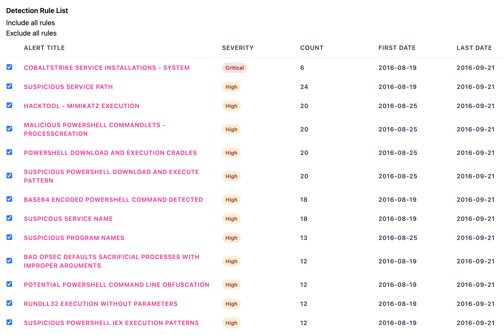

<div align="center">
 <p>
    
 </p>
 [ <b>English</b> ] | [<a href="README-Japanese.md">日本語</a>]
</div>

---

<p align="center">
    <a href="https://github.com/Yamato-Security/takajo/releases"></a>
    <a href="https://github.com/Yamato-Security/takajo/releases"></a>
    <a href="https://github.com/Yamato-Security/takajo/stargazers"></a>
    <a href="https://codeblue.jp/2022/en/talks/?content=talks_24"></a>
    <a href="https://www.seccon.jp/2022/seccon_workshop/windows.html"></a>
    <a href="https://www.sans.org/cyber-security-training-events/digital-forensics-summit-2023/"></a>
    <a href="https://bsides.tokyo/2024/"></a>
    <a href="https://www.hacker.or.jp/hack-fes-2024/"></a>
    <a href="https://hitcon.org/2024/CMT/"></a>
    <a href="https://www.blackhat.com/sector/2024/briefings/schedule/index.html#performing-dfir-and-threat-hunting-with-yamato-security-oss-tools-and-community-driven-knowledge-41347"></a>
    <a href=""></a>
    <a href="https://twitter.com/SecurityYamato"></a>
</p>

## About Takajō

Takajō (鷹匠), created by [Yamato Security](https://github.com/Yamato-Security), is a fast forensics analyzer for [Hayabusa](https://github.com/Yamato-Security/hayabusa) results written in [Nim](https://nim-lang.org/).
Takajō means ["Falconer"](https://en.wikipedia.org/wiki/Falconry) in Japanese and was chosen as it analyzes Hayabusa's "catches" (results).

# Companion Projects

* [EnableWindowsLogSettings](https://github.com/Yamato-Security/EnableWindowsLogSettings) - documentation and scripts to properly enable Windows event logs.
* [Hayabusa](https://github.com/Yamato-Security/hayabusa) - sigma-based threat hunting and fast forensics timeline generator for Windows event logs.
* [Hayabusa Rules](https://github.com/Yamato-Security/hayabusa-rules) - detection rules for hayabusa.
* [Hayabusa Sample EVTXs](https://github.com/Yamato-Security/hayabusa-sample-evtx) - sample evtx files to use for testing hayabusa/sigma detection rules.
* [WELA (Windows Event Log Analyzer)](https://github.com/Yamato-Security/WELA) - analyzer for Windows event logs written in PowerShell.

## Table of Contents

- [Companion Projects](#companion-projects)
  - [Table of Contents](#table-of-contents)
  - [Features](#features)
- [Downloads](#downloads)
  - [Git cloning](#git-cloning)
  - [Advanced: Compiling From Source (Optional)](#advanced-compiling-from-source-optional)
- [Command List](#command-list)
  - [Automation Commands](#automation-commands)
  - [Extract Commands](#extract-commands)
  - [HTML Commands](#html-commands)
  - [List Commands](#list-commands)
  - [Split Commands](#split-commands)
  - [Stack Commands](#stack-commands)
  - [Sysmon Commands](#sysmon-commands)
  - [Timeline Commands](#timeline-commands)
  - [TTP Commands](#ttp-commands)
  - [VirusTotal Commands](#virustotal-commands)
- [Command Usage](#command-usage)
  - [Automation Commands](#automation-commands-1)
    - [`automagic` command](#automagic-command)
      - [`automagic` command examples](#automagic-command-examples)
  - [Extract Commands](#extract-commands-1)
    - [`extract-scriptblocks` command](#extract-scriptblocks-command)
      - [`extract-scriptblocks` command example](#extract-scriptblocks-command-example)
      - [`extract-scriptblocks` screenshot](#extract-scriptblocks-screenshot)
  - [HTML Commands](#html-commands-1)
    - [`html-report` command](#html-report-command)
      - [`html-report` command example](#html-report-command-example)
      - [`html-report` screenshots](#html-report-screenshots)
        - [Rule Summary](#rule-summary)
        - [Computer Summary](#computer-summary)
        - [Rule List](#rule-list)
    - [`html-server` command](#html-server-command)
      - [`html-report` command example](#html-report-command-example-1)
      - [`html-server` screenshots](#html-server-screenshots)
        - [Rules List](#rules-list)
        - [Computer Summary](#computer-summary-1)
        - [Rule Filtering](#rule-filtering)
        - [Rule Filtering](#rule-filtering-1)
  - [List Commands](#list-commands-1)
    - [`list-domains` command](#list-domains-command)
      - [`list-domains` command examples](#list-domains-command-examples)
    - [`list-hashes` command](#list-hashes-command)
      - [`list-hashes` command examples](#list-hashes-command-examples)
    - [`list-ip-addresses` command](#list-ip-addresses-command)
      - [`list-ip-addresses` command examples](#list-ip-addresses-command-examples)
    - [`list-undetected-evtx` command](#list-undetected-evtx-command)
      - [`list-undetected-evtx` command examples](#list-undetected-evtx-command-examples)
    - [`list-unused-rules` command](#list-unused-rules-command)
      - [`list-unused-rules` command examples](#list-unused-rules-command-examples)
  - [Split Commands](#split-commands-1)
    - [`split-csv-timeline` command](#split-csv-timeline-command)
      - [`split-csv-timeline` command examples](#split-csv-timeline-command-examples)
    - [`split-json-timeline` command](#split-json-timeline-command)
      - [`split-json-timeline` command examples](#split-json-timeline-command-examples)
  - [Stack Commands](#stack-commands-1)
    - [`stack-cmdlines` command](#stack-cmdlines-command)
      - [`stack-cmdlines` command examples](#stack-cmdlines-command-examples)
    - [`stack-computers` command](#stack-computers-command)
      - [`stack-computers` command examples](#stack-computers-command-examples)
    - [`stack-dns` command](#stack-dns-command)
      - [`stack-dns` command examples](#stack-dns-command-examples)
    - [`stack-ip-addresses` command](#stack-ip-addresses-command)
      - [`stack-ip-addresses` command examples](#stack-ip-addresses-command-examples)
    - [`stack-logons` command](#stack-logons-command)
      - [`stack-logons` command examples](#stack-logons-command-examples)
    - [`stack-processes` command](#stack-processes-command)
      - [`stack-processes` command examples](#stack-processes-command-examples)
    - [`stack-services` command](#stack-services-command)
      - [`stack-services` command examples](#stack-services-command-examples)
    - [`stack-tasks` command](#stack-tasks-command)
      - [`stack-tasks` command examples](#stack-tasks-command-examples)
    - [`stack-users` command](#stack-users-command)
      - [`stack-users` command examples](#stack-users-command-examples)
  - [Sysmon Commands](#sysmon-commands-1)
    - [`sysmon-process-tree` command](#sysmon-process-tree-command)
      - [`sysmon-process-tree` command examples](#sysmon-process-tree-command-examples)
      - [`sysmon-process-tree` screenshot](#sysmon-process-tree-screenshot)
  - [Timeline Commands](#timeline-commands-1)
    - [`timeline-logon` command](#timeline-logon-command)
      - [`timeline-logon` command examples](#timeline-logon-command-examples)
      - [`timeline-logon` screenshot](#timeline-logon-screenshot)
    - [`timeline-partition-diagnostic` command](#timeline-partition-diagnostic-command)
      - [`timeline-partition-diagnostic` command examples](#timeline-partition-diagnostic-command-examples)
    - [`timeline-suspicious-processes` command](#timeline-suspicious-processes-command)
      - [`timeline-suspicious-processes` command examples](#timeline-suspicious-processes-command-examples)
      - [`timeline-suspicious-processes` screenshot](#timeline-suspicious-processes-screenshot)
    - [`timeline-tasks` command](#timeline-tasks-command)
      - [`timeline-tasks` command examples](#timeline-tasks-command-examples)
  - [TTP Commands](#ttp-commands-1)
    - [`ttp-summary` command](#ttp-summary-command)
      - [`ttp-summary` command examples](#ttp-summary-command-examples)
      - [`ttp-summary` screenshot](#ttp-summary-screenshot)
    - [`ttp-visualize` command](#ttp-visualize-command)
      - [`ttp-visualize` command examples](#ttp-visualize-command-examples)
      - [`ttp-visualize` screenshot](#ttp-visualize-screenshot)
    - [`ttp-visualize-sigma` command](#ttp-visualize-sigma-command)
      - [`ttp-visualize-sigma` command examples](#ttp-visualize-sigma-command-examples)
  - [VirusTotal Commands](#virustotal-commands-1)
    - [`vt-domain-lookup` command](#vt-domain-lookup-command)
      - [`vt-domain-lookup` command examples](#vt-domain-lookup-command-examples)
    - [`vt-hash-lookup` command](#vt-hash-lookup-command)
      - [`vt-hash-lookup` command examples](#vt-hash-lookup-command-examples)
    - [`vt-ip-lookup` command](#vt-ip-lookup-command)
      - [`vt-ip-lookup` command examples](#vt-ip-lookup-command-examples)
  - [Contribution](#contribution)
  - [Bug Submission](#bug-submission)
  - [License](#license)
  - [Twitter](#twitter)

## Features

- Written in Nim so it is very easy to program, memory safe, as fast as native C code and works as a single standalone binary on any OS.
- Print the process trees of a malicious processes.
- Split up CSV and JSONL timelines.
- Extracting IP addresses, domains, hashes etc... to be used with VirusTotal lookups
- VirusTotal lookups of domains, hashes and IP addresses.
- List up `.evtx` files that cannot be detected yet.
- Visualize TTPs with heatmaps in MITRE ATT&CK Navigator.
- Stacking command lines, DNS requests, logons, processes, services, tasks, etc...
- Timelines for logons, USB usage, suspicious processes, tasks, etc...
- HTML summary reports
- Many more!

# Downloads

Please download the latest stable version of Takajo with compiled binaries or compile the source code from the [Releases](https://github.com/Yamato-Security/takajo/releases) page.

> Note: we provide release binaries for 64-bit Windows and Intel and Arm-based macOS but not Linux because it is difficult to provide MUSL binaries for Linux at the moment.

## Git cloning

You can git clone the repository with the following command and compile binary from source code:

> Warning: The main branch of the repository is for development purposes so you may be able to access new features not yet officially released, however, there may be bugs so consider it unstable.

`git clone https://github.com/Yamato-Security/takajo.git`

## Advanced: Compiling From Source (Optional)

First, install Nim with [choosenim](https://github.com/nim-lang/choosenim).
Then you can compile from source with the following command:

```
> nimble update
> nimble build -d:release --threads:on
```

# Command List

## Automation Commands
* `automagic`: automatically executes as many commands as possible and output results to a new folder

## Extract Commands
* `extract-scriptblocks`: extract and reassemble PowerShell EID 4104 script block logs

## HTML Commands
* `html-report`: create static HTML summary reports
* `html-server`: create a dynamic web server to view HTML summary reports

## List Commands
* `list-domains`: create a list of unique domains to be used with `vt-domain-lookup`
* `list-hashes`: create a list of process hashes to be used with `vt-hash-lookup`
* `list-ip-addresses`: create a list of unique target and/or source IP addresses to be used with `vt-ip-lookup`
* `list-undetected-evtx`: create a list of undetected evtx files
* `list-unused-rules`: create a list of unused detection rules

## Split Commands
* `split-csv-timeline`: split up a large CSV timeline into smaller ones based on the computer name
* `split-json-timeline`: split up a large JSONL timeline into smaller ones based on the computer name

## Stack Commands
* `stack-cmdlines`: stack executed command lines
* `stack-computers`: stack computers
* `stack-dns`: stack DNS queries and responses
* `stack-ip-addresses`: stack target IP addresses (`TgtIP` field) or source IP addresses (`SrcIP` field)
* `stack-logons`: stack logons by target user, target computer, source IP address and source computer
* `stack-processes`: stack executed processes
* `stack-services`: stack service names and paths from `System 7040` and `Security 4697` events
* `stack-tasks`: stack new scheduled tasks from `Security 4698` events and parse out XML task content
* `stack-users`: stack target users (`TgtUser` field) or source users (`SrcUser` field)

## Sysmon Commands
* `sysmon-process-tree`: output the process tree of a certain process

## Timeline Commands
* `timeline-logon`: create a CSV timeline of logon events
* `timeline-partition-diagnostic`: create a CSV timeline of partition diagnostic events
* `timeline-suspicious-processes`: create a CSV timeline of suspicious processes
* `timeline-tasks`: create a CSV timeline of scheduled tasks

## TTP Commands
* `ttp-summary`: summarize tactics and techniques found in each computer
* `ttp-visualize`: extract TTPs and create a JSON file to visualize in MITRE ATT&CK Navigator
* `ttp-visualize-sigma`: extract TTPs from Sigma rules and create a JSON file to visualize in MITRE ATT&CK Navigator

## VirusTotal Commands
* `vt-domain-lookup`: look up a list of domains on VirusTotal and report on malicious ones
* `vt-hash-lookup`: look up a list of hashes on VirusTotal and report on malicious ones
* `vt-ip-lookup`: look up a list of IP addresses on VirusTotal and report on malicious ones

# Command Usage

## Automation Commands

### `automagic` command

Automatically executes as many commands as possible and output results to a new folder

> Note: You should use the `verbose` or `super-verbose` profile to utilize all commands.

* Input: JSONL file or directory of JSONL files
* Profile: Any besides `all-field-info` and `all-field-info-verbose`
* Output: A new folder with all of the results in different files

Required options:

- `-t, --timeline <JSONL-FILE-OR-DIR>`: Hayabusa JSONL timeline file or directory.

Options:

- `-d, --displayTable`: display the results table (default: `false`)
- `-l, --level`: specify the minimum alert level (default: `low`)
- `-o, --output`: output directory (default: `case-1`)
- `-q, --quiet`: do not display the launch banner (default: `false`)
- `-s, --skipProgressBar`: do not display the progress bar (default: `false`)

#### `automagic` command examples

Prepare the JSONL timeline with Hayabusa:

```
hayabusa.exe json-timeline -d <EVTX-DIR> -L -o timeline.jsonl -w -p verbose
```

Run as many Takajo commands as possible and save results under the `case-1` folder:

```
takajo.exe automagic -t ../hayabusa/timeline.jsonl -o case-1
```

Run as many Takajo commands as possible on the `hayabusa-results` directory and save results under the `case-1` folder:

```
takajo.exe automagic -t ../hayabusa/hayabusa-results/ -o case-1
```


## Extract Commands

### `extract-scriptblocks` command

Extracts and reassemles PowerShell EID 4104 script block logs.

> Note: The PowerShell scripts are best opened as `.ps1` files with code syntax highlighting but we use the `.txt` extension in order to prevent any accidental running of malicious code.

* Input: JSONL
* Profile: Any
* Output: Terminal and directory of PowerShell Scripts

Required options:

- `-t, --timeline <JSONL-FILE-OR-DIR>`: Hayabusa JSONL timeline file or directory

Options:

 - `-l, --level`: specify the minimum alert level (default: `low`)
 - `-o, --output`: output directory (default: `scriptblock-logs`)
 - `-q, --quiet`: do not display the launch banner (default: `false`)
 - `-s, --skipProgressBar`: do not display the progress bar (default: `false`)

#### `extract-scriptblocks` command example

Prepare the JSONL timeline with Hayabusa:

```
hayabusa.exe json-timeline -d <EVTX-DIR> -L -o timeline.jsonl -w
```

Extract PowerShell EID 4104 script block logs to the `scriptblock-logs` directory:

```
takajo.exe extract-scriptblocks -t ../hayabusa/timeline.jsonl
```

#### `extract-scriptblocks` screenshot


## HTML Commands

### `html-report` command

Create HTML summary reports for rules and computers with detections.
This command first creates an indexed SQLite database file in order to perform fast lookups on the data needed to create the summary reports.

* Input: JSONL
* Profile: Any verbose profile
* Output: Individual HTML summary reports based on computer name as well as an `index.html` main page

Required options:

- `-o, --output`: html report directory name
- `-r, --rulepath`: path to the Hayabusa rules directory
- `-t, --timeline <JSONL-FILE-OR-DIR>`: Hayabusa JSONL timeline file or directory

Options:

- `-C, --clobber`: overwrite the SQLite file when saving (default: `false`)
- `-q, --quiet`: do not display the launch banner (default: `false`)
- `-s, --skipProgressBar`: do not display the progress bar (default: `false`)
- `-s, --sqliteoutput`: save results to a SQLite database (default: `html-report.sqlite`)

#### `html-report` command example

Prepare the JSONL timeline with Hayabusa:

```
hayabusa.exe json-timeline -d <EVTX-DIR> -L -o timeline.jsonl -w -p verbose
```

or

```
hayabusa.exe json-timeline -d <EVTX-DIR> -L -o timeline.jsonl -w -p super-verbose
```

Create the HTML summary reports:

```
takajo.exe html-report -t ../hayabusa/hayabusa-results.jsonl -o htmlreport -r ../hayabusa/rules
```

#### `html-report` screenshots

##### Rule Summary


##### Computer Summary


##### Rule List


### `html-server` command

Create a dynamic web server to view HTML summary reports.
This command first creates an indexed SQLite database file in order to perform fast lookups on the data needed to create the summary reports.
It is similar to the `html-report` command but is more scalable and allows for filtering on dates and rules.

* Input: JSONL
* Profile: Any verbose profile
* Output: By default, will listen on `http://localhost:8823`

Required options:

- `-t, --timeline <JSONL-FILE-OR-DIR>`: Hayabusa JSONL timeline file or directory

Options:

- `-C, --clobber`: overwrite the SQLite file when saving (default: `false`)
- `-p, --port`: web server port number
- `-q, --quiet`: do not display the launch banner (default: `false`)
- `-r, --rulepath`: path to the Hayabusa rules directory (this is optional but needed to create correct links to the rule files)
- `-s, --skipProgressBar`: do not display the progress bar (default: `false`)
- `-s, --sqliteoutput`: save results to a SQLite database (default: `html-report.sqlite`)

#### `html-report` command example

Prepare the JSONL timeline with Hayabusa:

```
hayabusa.exe json-timeline -d <EVTX-DIR> -L -o timeline.jsonl -w -p verbose
```

or

```
hayabusa.exe json-timeline -d <EVTX-DIR> -L -o timeline.jsonl -w -p super-verbose
```

Start the web server:

```
takajo.exe html-server -t ../hayabusa/hayabusa-results.jsonl -r ../hayabusa/rules
```

#### `html-server` screenshots

##### Rules List


##### Computer Summary


##### Rule Filtering


##### Rule Filtering



## List Commands

### `list-domains` command

Creates a list of unique domains to be used with `vt-domain-lookup`.
Currently it will only check queried domains in Sysmon EID 22 logs but will be updated to support built-in Windows DNS Client and Server logs.

* Input: JSONL
* Profile: Any besides `all-field-info` and `all-field-info-verbose`
* Output: Text file

Required options:

 - `-o, --output <TXT-FILE>`: save results to a text file.
 - `-t, --timeline <JSONL-FILE-OR-DIR>`: Hayabusa JSONL timeline file or directory.

Options:

 - `-s, --includeSubdomains`: include subdomains (default: `false`)
 - `-w, --includeWorkstations`: include local workstation names (default: `false`)
 - `-q, --quiet`: do not display logo (default: `false`)
 - `-s, --skipProgressBar`: do not display the progress bar (default: `false`)

#### `list-domains` command examples

Prepare the JSONL timeline with Hayabusa:

```
hayabusa.exe json-timeline -d <EVTX-DIR> -L -o timeline.jsonl -w
```

Save the results to a text file:

```
takajo.exe list-domains -t ../hayabusa/timeline.jsonl -o domains.txt
```

Include subdomains:

```
takajo.exe list-domains -t ../hayabusa/timeline.jsonl -o domains.txt -s
```

### `list-hashes` command

Create a list of process hashes to be used with vt-hash-lookup (input: JSONL, profile: standard)

* Input: JSONL
* Profile: Any besides `all-field-info` and `all-field-info-verbose`
* Output: Text file

Required options:

 - `-t, --timeline <JSONL-FILE-OR-DIR>`: Hayabusa JSONL timeline file or directory of JSONL files
 - `-o, --output <BASE-NAME>`: specify the base name to save the text results to.

Options:

 - `-l, --level`: specify the minimum level. (default: `high`)
 - `-q, --quiet`: do not display logo. (default: `false`)
 - `-s, --skipProgressBar`: do not display the progress bar (default: `false`)

#### `list-hashes` command examples

Prepare JSONL timeline with Hayabusa:

```
hayabusa.exe json-timeline -d <EVTX-DIR> -L -o timeline.jsonl -w
```

Save the results to a different text file for each hash type:

```
takajo.exe list-hashes -t ../hayabusa/timeline.jsonl -o case-1
```

For example, if `MD5`, `SHA1` and `IMPHASH` hashes are stored in the sysmon logs, then the following files will be created: `case-1-MD5-hashes.txt`, `case-1-SHA1-hashes.txt`, `case-1-ImportHashes.txt`

### `list-ip-addresses` command

Creates a list of unique target and/or source IP addresses to be used with `vt-ip-lookup`.
It will extract the `TgtIP` fields for target IP addresses and `SrcIP` fields for source IP addresses in all results and output just the unique IP addresses to a text file.

* Input: JSONL
* Profile: Any besides `all-field-info` and `all-field-info-verbose`
* Output: Text file

Required options:

 - `-o, --output <TXT-FILE>`: save results to a text file.
 - `-t, --timeline <JSONL-FILE-OR-DIR>`: Hayabusa JSONL timeline file or directory.

Options:

 - `-i, --inbound`: include inbound traffic. (default: `true`)
 - `-O, --outbound`: include outbound traffic. (default: `true`)
 - `-p, --privateIp`: include private IP addresses (default: `false`)
 - `-q, --quiet`: do not display logo. (default: `false`)
 - `-s, --skipProgressBar`: "do not display the progress bar (default: `false`)

#### `list-ip-addresses` command examples

Prepare the JSONL timeline with Hayabusa:

```
hayabusa.exe json-timeline -d <EVTX-DIR> -L -o timeline.jsonl -w
```

Save the results to a text file:

```
takajo.exe list-ip-addresses -t ../hayabusa/timeline.jsonl -o ipAddresses.txt
```

Exclude inbound traffic:

```
takajo.exe list-ip-addresses -t ../hayabusa/timeline.jsonl -o ipAddresses.txt -i=false
```

Include private IP addresses:

```
takajo.exe list-ip-addresses -t ../hayabusa/timeline.jsonl -o ipAddresses.txt -p
```

### `list-undetected-evtx` command

List up all of the `.evtx` files that Hayabusa didn't have a detection rule for.
This is meant to be used on sample evtx files that all contain evidence of malicious activity such as the sample evtx files in the [hayabusa-sample-evtx](https://github.com/Yamato-Security/hayabusa-evtx) repository.

* Input: CSV
* Profile: `verbose`, `all-field-info-verbose`, `super-verbose`, `timesketch-verbose`
  > You first need to run Hayabusa with a profile that saves the `%EvtxFile%` column information and save the results to a CSV timeline.
  > You can see which columns Hayabusa saves according to the different profiles [here](https://github.com/Yamato-Security/hayabusa#profiles).
* Output: Terminal or text file

Required options:

- `-e, --evtx-dir <EVTX-DIR>`: The directory of `.evtx` files you scanned with Hayabusa.
- `-t, --timeline <CSV-FILE>`: Hayabusa CSV timeline.

Options:

- `-c, --column-name <CUSTOM-EVTX-COLUMN>`: specify a custom column name for the evtx column. (default: Hayabusa's default of `EvtxFile`)
- `-o, --output <TXT-FILE>`: save the results to a text file. (default: output to screen)
- `-q, --quiet`: do not display logo. (default: `false`)

#### `list-undetected-evtx` command examples

Prepare the CSV timeline with Hayabusa:

```
hayabusa.exe -d <EVTX-DIR> -p verbose -o timeline.csv -w
```

Output the results to screen:

```
takajo.exe list-undetected-evtx -t ../hayabusa/timeline.csv -e <EVTX-DIR>
```

Save the results to a text file:

```
takajo.exe list-undetected-evtx -t ../hayabusa/timeline.csv -e <EVTX-DIR> -o undetected-evtx.txt
```

### `list-unused-rules` command

List up all of the `.yml` detection rules that did not detect anything.
This is useful to help determine the reliablity of rules.
That is, which rules are known to find malicious activity and which are still untested and need sample `.evtx` files.

* Input: CSV
* Profile: `verbose`, `all-field-info-verbose`, `super-verbose`, `timesketch-verbose`
  > You first need to run Hayabusa with a profile that saves the `%RuleFile%` column information and save the results to a CSV timeline.
  > You can see which columns Hayabusa saves according to the different profiles [here](https://github.com/Yamato-Security/hayabusa#profiles).
* Output: Termianl or text file

Required options:

- `-r, --rules-dir <DIR>`: the directory of `.yml` rules files you used with Hayabusa.
- `-t, --timeline <CSV-FILE>`: CSV timeline created by Hayabusa.

Options:

- `-c, --column-name <CUSTOM-RULE-FILE-COLUMN>`: specify a custom column name for the rule file column. (default: Hayabusa's default of `RuleFile`)
- `-o, --output <TXT-FILE>`: save the results to a text file. (default: output to screen)
- `-q, --quiet`: do not display logo. (default: `false`)

#### `list-unused-rules` command examples

Prepare the CSV timeline with Hayabusa:

```
hayabusa.exe csv-timeline -d <EVTX-DIR> -p verbose -o timeline.csv -w
```

Output the results to screen:

```
takajo.exe list-unused-rules -t ../hayabusa/timeline.csv -r ../hayabusa/rules
```

Save the results to a text file:

```
takajo.exe list-unused-rules -t ../hayabusa/timeline.csv -r ../hayabusa/rules -o unused-rules.txt
```

## Split Commands

### `split-csv-timeline` command

Split up a large CSV timeline into smaller ones based on the computer name.

* Input: Non-multiline CSV
* Profile: Any
* Output: Multiple CSV files

Required options:

- `-t, --timeline <CSV-FILE>`: CSV timeline created by Hayabusa.

Options:

- `-m, --makeMultiline`: output fields in multiple lines. (default: `false`)
- `-o, --output <DIR>`: directory to save the CSV files to. (default: `output`)
- `-q, --quiet`: do not display logo. (default: `false`)

#### `split-csv-timeline` command examples

Prepare the CSV timeline with Hayabusa:

```
hayabusa.exe csv-timeline -d <EVTX-DIR> -o timeline.csv -w
```

Split the single CSV timeline into multiple CSV timelines in the default `output` directory:

```
takajo.exe split-csv-timeline -t ../hayabusa/timeline.csv
```

Separate field information with newline characters to make multi-line entries and save to the `case-1-csv` directory:

```
takajo.exe split-csv-timeline -t ../hayabusa/timeline.csv -m -o case-1-csv
```

### `split-json-timeline` command

Split up a large JSONL timeline into smaller ones based on the computer name.

* Input: JSONL
* Profile: Any
* Output: Multiple JSONL files

Required options:

- `-t, --timeline <JSONL-FILE-OR-DIR>`: Hayabusa JSONL timeline file or directory.

Options:

- `-o, --output <DIR>`: directory to save the JSONL files to. (default: `output`)
- `-q, --quiet`: do not display logo. (default: `false`)

#### `split-json-timeline` command examples

Prepare the JSONL timeline with Hayabusa:

```
hayabusa.exe json-timeline -d <EVTX-DIR> -L -o timeline.jsonl -w
```

Split the single JSONL timeline into multiple JSONL timelines in the default `output` directory:

```
takajo.exe split-json-timeline -t ../hayabusa/timeline.jsonl
```

Save to the `case-1-jsonl` directory:

```
takajo.exe split-json-timeline -t ../hayabusa/timeline.jsonl -o case-1-jsonl
```

## Stack Commands

### `stack-cmdlines` command

This command will stack executed command lines by extracting information from `Sysmon 1` and `Security 4688` events.

* Input: JSONL
* Profile: Any besides `all-field-info` and `all-field-info-verbose`
* Output: Terminal or CSV file

Required options:

- `-t, --timeline <JSONL-FILE-OR-DIR>`: Hayabusa JSONL timeline file or directory of JSONL files

Options:

- `-l, --level`: specify the minimum alert level (default: `informational`)
- `-y, --ignoreSysmon`: exclude Sysmon 1 events (default: `false`)
- `-e, --ignoreSecurity`: exclude Security 4688 events (default: `false`)
- `-o, --output <CSV-FILE>`: the CSV file to save the results to (default: `stdout`)
- `-q, --quiet`: do not display logo. (default: `false`)
- `-s, --skipProgressBar`: do not display the progress bar (default: `false`)

#### `stack-cmdlines` command examples

Output to terminal:

```
takajo.exe stack-cmdlines -t ../hayabusa/timeline.jsonl
```

Save to CSV:

```
takajo.exe stack-cmdlines -t ../hayabusa/timeline.jsonl -o stack-cmdlines.csv
```

### `stack-computers` command

This command will stack computer hostnames according to the `Computer` field.

* Input: JSONL
* Profile: Any besides `all-field-info` and `all-field-info-verbose`
* Output: Terminal or CSV file

Required options:

- `-t, --timeline <JSONL-FILE-OR-DIR>`: Hayabusa JSONL timeline file or directory of JSONL files

Options:

- `-l, --level`: specify the minimum alert level (default: `informational`)
- `-c, --sourceComputers`: stack source computers instead of target computers (default: false)
- `-o, --output <CSV-FILE>`: the CSV file to save the results to (default: `stdout`)
- `-q, --quiet`: do not display logo. (default: `false`)
- `-s, --skipProgressBar`: do not display the progress bar (default: `false`)

#### `stack-computers` command examples

Output to terminal:

```
takajo.exe stack-computers -t ../hayabusa/timeline.jsonl
```

Save to CSV:

```
takajo.exe stack-computers -t ../hayabusa/timeline.jsonl -o stack-computers.csv
```

### `stack-dns` command

This command will stack DNS queries and responses from Sysmon 22 events.

* Input: JSONL
* Profile: Any besides `all-field-info` and `all-field-info-verbose`
* Output: Terminal or CSV file

Required options:

- `-t, --timeline <JSONL-FILE-OR-DIR>`: Hayabusa JSONL timeline file or directory of JSONL files

Options:

- `-l, --level`: specify the minimum alert level (default: `informational`)
- `-o, --output <CSV-FILE>`: the CSV file to save the results to (default: `stdout`)
- `-q, --quiet`: do not display logo. (default: `false`)
- `-s, --skipProgressBar`: do not display the progress bar (default: `false`)

#### `stack-dns` command examples

Output to terminal:

```
takajo.exe stack-dns -t ../hayabusa/timeline.jsonl
```

Save to CSV:

```
takajo.exe stack-dns -t ../hayabusa/timeline.jsonl -o stack-dns.csv
```

### `stack-ip-addresses` command

This command will stack the target IP addresses (`TgtIP` field) or source IP addresses (`SrcIP` field).

* Input: JSONL
* Profile: Any besides `all-field-info` and `all-field-info-verbose`
* Output: Terminal or CSV file

Required options:

- `-t, --timeline <JSONL-FILE-OR-DIR>`: Hayabusa JSONL timeline file or directory of JSONL files

Options:

- `-l, --level`: specify the minimum alert level (default: `informational`)
- `-a, --targetIpAddresses`: stack target IP addresses instead of source IP addresses (default: `false`)
- `-o, --output <CSV-FILE>`: the CSV file to save the results to (default: `stdout`)
- `-q, --quiet`: do not display logo. (default: `false`)
- `-s, --skipProgressBar`: do not display the progress bar (default: `false`)

#### `stack-ip-addresses` command examples

Output to terminal:

```
takajo.exe stack-ip-addresses -t ../hayabusa/timeline.jsonl
```

Save to CSV:

```
takajo.exe stack-ip-addresses -t ../hayabusa/timeline.jsonl -o stack-ip-addresses.csv
```

### `stack-logons` command

Creates a list logons according to `Target User`, `Target Computer`, `Logon Type`, `Source IP Address`, `Source Computer`.
Results are filtered out when the source IP address is a local IP address by default.

* Input: JSONL
* Profile: Any besides `all-field-info` and `all-field-info-verbose`
* Output: Terminal or CSV file

Required options:

- `-t, --timeline <JSONL-FILE-OR-DIR>`: Hayabusa JSONL timeline file or directory of JSONL files

Options:

- `-l, --localSrcIpAddresses`: include results when the source IP address is local.
- `-o, --output <CSV-FILE>`: the CSV file to save the results to (default: `stdout`)
- `-q, --quiet`: do not display logo. (default: `false`)
- `-s, --skipProgressBar`: do not display the progress bar (default: `false`)

#### `stack-logons` command examples

Run with default settings:

```
takajo.exe stack-logons -t ../hayabusa/timeline.jsonl
```

Include local logons:

```
takajo.exe stack-logons -t ../hayabusa/timeline.jsonl -l
```

### `stack-processes` command

This command will stack executed processes from Sysmon 1 and Security 4688 events.

* Input: JSONL
* Profile: Any besides `all-field-info` and `all-field-info-verbose`
* Output: Terminal or CSV file

Required options:

- `-t, --timeline <JSONL-FILE-OR-DIR>`: Hayabusa JSONL timeline file or directory of JSONL files

Options:

- `-l, --level`: specify the minimum alert level (default: `low`)
- `-y, --ignoreSysmon`: exclude Sysmon 1 events (default: `false`)
- `-e, --ignoreSecurity`: exclude Security 4688 events (default: `false`)
- `-o, --output <CSV-FILE>`: the CSV file to save the results to (default: `stdout`)
- `-q, --quiet`: do not display logo. (default: `false`)
- `-s, --skipProgressBar`: do not display the progress bar (default: `false`)

#### `stack-processes` command examples

Output to terminal:

```
takajo.exe stack-processes -t ../hayabusa/timeline.jsonl
```

Save to CSV:

```
takajo.exe stack-processes -t ../hayabusa/timeline.jsonl -o stack-processes.csv
```

### `stack-services` command

This command will stack service names and paths from System 7040 and Security 4697 events.

* Input: JSONL
* Profile: Any besides `all-field-info` and `all-field-info-verbose`
* Output: Terminal or CSV file

Required options:

- `-t, --timeline <JSONL-FILE-OR-DIR>`: Hayabusa JSONL timeline file or directory of JSONL files

Options:

- `-l, --level`: specify the minimum alert level (default: `informational`)
- `-y, --ignoreSystem`: exclude System 7040 events (default: `false`)
- `-e, --ignoreSecurity`: exclude Security 4697 events (default: `false`)
- `-o, --output <CSV-FILE>`: the CSV file to save the results to (default: `stdout`)
- `-q, --quiet`: do not display logo. (default: `false`)
- `-s, --skipProgressBar`: do not display the progress bar (default: `false`)

#### `stack-services` command examples

Output to terminal:

```
takajo.exe stack-services -t ../hayabusa/timeline.jsonl
```

Save to CSV:

```
takajo.exe stack-services -t ../hayabusa/timeline.jsonl -o stack-services.csv
```

### `stack-tasks` command

This command will stack new scheduled tasks from Security 4698 events and parse out the XML task content.

* Input: JSONL
* Profile: Any besides `all-field-info` and `all-field-info-verbose`
* Output: Terminal or CSV file

Required options:

- `-t, --timeline <JSONL-FILE-OR-DIR>`: Hayabusa JSONL timeline file or directory of JSONL files

Options:

- `-l, --level`: specify the minimum alert level (default: `informational`)
- `-o, --output <CSV-FILE>`: the CSV file to save the results to (default: `stdout`)
- `-q, --quiet`: do not display logo. (default: `false`)
- `-s, --skipProgressBar`: do not display the progress bar (default: `false`)

#### `stack-tasks` command examples

Output to terminal:

```
takajo.exe stack-tasks -t ../hayabusa/timeline.jsonl
```

Save to CSV:

```
takajo.exe stack-tasks -t ../hayabusa/timeline.jsonl -o stack-tasks.csv
```

### `stack-users` command

This command will stack the target users (`TgtUser` field (default)) or source users (`SrcUser` field) in any event that has those fields as well as show alert information.

* Input: JSONL
* Profile: Any besides `all-field-info` and `all-field-info-verbose`
* Output: Terminal or CSV file

Required options:

- `-t, --timeline <JSONL-FILE-OR-DIR>`: Hayabusa JSONL timeline file or directory of JSONL files

Options:

- `-s, --sourceUsers`: stack source users instead of target users (default: false)
- `-c, --filterComputerAccounts`: filter out computer accounts (default: true)
- `-f, --filterSystemAccounts`: filter out system accounts (default: true)
- `-l, --level`: specify the minimum alert level (default: `informational`)
- `-o, --output <CSV-FILE>`: the CSV file to save the results to (default: `stdout`)
- `-q, --quiet`: do not display logo. (default: `false`)
- `-s, --skipProgressBar`: do not display the progress bar (default: `false`)

#### `stack-users` command examples

Output to terminal:

```
takajo.exe stack-users -t ../hayabusa/timeline.jsonl
```

Save to CSV:

```
takajo.exe stack-users -t ../hayabusa/timeline.jsonl -o stack-users.csv
```

## Sysmon Commands

### `sysmon-process-tree` command

Output the process tree of a certain process, such as a suspicious or malicious process.

* Input: JSONL
* Profile: Any besides `all-field-info` and `all-field-info-verbose`
* Output: Terminal or text file

Required options:

- `-p, --processGuid <Process GUID>`: sysmon process GUID
- `-t, --timeline <JSONL-FILE-OR-DIR>`: Hayabusa JSONL timeline file or directory of JSONL files

Options:

- `-o, --output <TXT-FILE>`: a text file to save the results to.
- `-q, --quiet`: do not display logo. (default: `false`)

#### `sysmon-process-tree` command examples

Prepare JSONL timeline with Hayabusa:

```
hayabusa.exe json-timeline -d <EVTX-DIR> -L -o timeline.jsonl -w
```

Save the results to a text file:

```
takajo.exe sysmon-process-tree -t ../hayabusa/timeline.jsonl -p "365ABB72-3D4A-5CEB-0000-0010FA93FD00" -o process-tree.txt
```

#### `sysmon-process-tree` screenshot


## Timeline Commands

### `timeline-logon` command

This command extracts information from the following logon events, normalizes the fields and saves the results to a CSV file:

- `4624` - Successful Logon
- `4625` - Failed Logon
- `4634` - Account Logoff
- `4647` - User Initiated Logoff
- `4648` - Explicit Logon
- `4672` - Admin Logon

This makes it easier to detect lateral movement, password guessing/spraying, privilege escalation, etc...

* Input: JSONL
* Profile: Any besides `all-field-info` and `all-field-info-verbose`
* Output: CSV

Required options:

- `-o, --output <CSV-FILE>`: the CSV file to save the results to.
- `-t, --timeline <JSONL-FILE-OR-DIR>`: Hayabusa JSONL timeline file or directory of JSONL files

Options:

- `-c, --calculateElapsedTime`: calculate the elapsed time for successful logons. (default: `true`)
- `-l, --outputLogoffEvents`: output logoff events as separate entries. (default: `false`)
- `-a, --outputAdminLogonEvents`: output admin logon events as separate entries. (default: `false`)
- `-q, --quiet`: do not display logo. (default: `false`)

#### `timeline-logon` command examples

Prepare JSONL timeline with Hayabusa:

```
hayabusa.exe json-timeline -d <EVTX-DIR> -L -o timeline.jsonl -w
```

Save logon timeline to a CSV file:

```
takajo.exe timeline-logon -t ../hayabusa/timeline.jsonl -o logon-timeline.csv
```

#### `timeline-logon` screenshot


### `timeline-partition-diagnostic` command

Creates a CSV timeline of partition diagnostic events by parsing Windows 10 `Microsoft-Windows-Partition%4Diagnostic.evtx` files and reporting information about all the connected devices and their Volume Serial Numbers, both currently present on the device and previously existed.
This process is based on the tool [Partition-4DiagnosticParser](https://github.com/theAtropos4n6/Partition-4DiagnosticParser).

* Input: JSONL
* Profile: Any
* Output: Terminal or CSV

Required options:

- `-t, --timeline <JSONL-FILE-OR-DIR>`: Hayabusa JSONL timeline file or directory of JSONL files

Options:

- `-o, --output <CSV-FILE>`: the CSV file to save the results to.
- `-q, --quiet`: do not display logo. (default: `false`)

#### `timeline-partition-diagnostic` command examples

Prepare JSONL timeline with Hayabusa:

```
hayabusa.exe json-timeline -d <EVTX-DIR> -L -o timeline.jsonl -w
```

Create a CSV timeline of connected devices:

```
takajo.exe timeline-partition-diagnostic -t ../hayabusa/timeline.jsonl -o partition-diagnostic-timeline.csv
```

### `timeline-suspicious-processes` command

Create a CSV timeline of suspicious processes.

* Input: JSONL
* Profile: Any besides `all-field-info` and `all-field-info-verbose`
* Output: Terminal or CSV

Required options:

- `-t, --timeline <JSONL-FILE-OR-DIR>`: Hayabusa JSONL timeline file or directory of JSONL files

Options:

- `-l, --level <LEVEL>`: specify the minimum alert level (default: `high`)
- `-o, --output <CSV-FILE>`: the CSV file to save the results to (default: `stdout`)
- `-q, --quiet`: do not display logo. (default: `false`)

#### `timeline-suspicious-processes` command examples

Prepare JSONL timeline with Hayabusa:

```
hayabusa.exe json-timeline -d <EVTX-DIR> -L -o timeline.jsonl -w
```

Search for processes that had an alert level of `high` or above and output results to screen:

```
takajo.exe timeline-suspicious-processes -t ../hayabusa/timeline.jsonl
```

Search for processes that had an alert level of `low` or above and output results to screen:

```
takajo.exe timeline-suspicious-processes -t ../hayabusa/timeline.jsonl -l low
```

Save the results to a CSV file:

```
takajo.exe timeline-suspicious-processes -t ../hayabusa/timeline.jsonl -o suspicous-processes.csv
```

#### `timeline-suspicious-processes` screenshot


### `timeline-tasks` command

This command will stack new scheduled tasks from Security 4698 events and parse out the XML task content.

* Input: JSONL
* Profile: Any besides `all-field-info` and `all-field-info-verbose`
* Output: Terminal or CSV file

Required options:

- `-t, --timeline <JSONL-FILE-OR-DIR>`: Hayabusa JSONL timeline file or directory of JSONL files

Options:

- `-o, --output <CSV-FILE>`: the CSV file to save the results to.
- `-q, --quiet`: do not display logo. (default: `false`)

#### `timeline-tasks` command examples

Output to terminal:

```
takajo.exe timeline-tasks -t ../hayabusa/timeline.jsonl
```

Save to CSV:

```
takajo.exe timeline-tasks -t ../hayabusa/timeline.jsonl -o timeline-tasks.csv
```

## TTP Commands

### `ttp-summary` command

This command summarize tactics and techniques found in each computer according to the MITRE ATT&CK TTPs defined in the `tags` field of the sigma rules.

* Input: JSONL
* Profile: A profile that outputs `%MitreTactics%` and `%MitreTags%` fields. (Ex: `verbose`, `all-field-info-verbose`, `super-verbose`)
* Output: Terminal or CSV

Required options:

- `-t, --timeline <JSONL-FILE-OR-DIR>`: Hayabusa JSONL timeline file or directory of JSONL files

Options:

- `-o, --output <CSV-FILE>`: the CSV file to save the results to.
- `-q, --quiet`: do not display logo. (default: `false`)

#### `ttp-summary` command examples

Prepare JSONL timeline with Hayabusa:

```
hayabusa.exe json-timeline -d <EVTX-DIR> -L -o timeline.jsonl -w -p verbose
```

Print TTP summary to terminal:

```
takajo.exe ttp-summary -t ../hayabusa/timeline.jsonl
```

Save the results to a CSV file:

```
takajo.exe ttp-summary -t ../hayabusa/timeline.jsonl -o ttp-summary.csv
```

#### `ttp-summary` screenshot


### `ttp-visualize` command

This command extracts TTPs and create a JSON file to visualize in [MITRE ATT&CK Navigator](https://mitre-attack.github.io/attack-navigator/).

* Input: JSONL
* Profile: A profile that outputs `%MitreTactics%` and `%MitreTags%` fields. (Ex: `verbose`, `all-field-info-verbose`, `super-verbose`)
* Output: Terminal or CSV

Required options:

- `-t, --timeline <JSONL-FILE-OR-DIR>`: Hayabusa JSONL timeline file or directory of JSONL files

Options:

- `-o, --output <JSON-FILE>`: the JSON file to save the results to. (default: `mitre-ttp-heatmap.json`)
- `-q, --quiet`: do not display logo. (default: `false`)

#### `ttp-visualize` command examples

Prepare JSONL timeline with Hayabusa:

```
hayabusa.exe json-timeline -d <EVTX-DIR> -L -o timeline.jsonl -w -p verbose
```

Extract out the TTPs and save to `mitre-ttp-heatmap.json`:

```
takajo.exe ttp-visualize -t ../hayabusa/timeline.jsonl
```

Open [https://mitre-attack.github.io/attack-navigator/](https://mitre-attack.github.io/attack-navigator/), click `Open Existing Layer` and upload the saved JSON file.

#### `ttp-visualize` screenshot


### `ttp-visualize-sigma` command

This command extracts TTPs from Sigma and create a JSON file to visualize in [MITRE ATT&CK Navigator](https://mitre-attack.github.io/attack-navigator/).

* Input: JSONL
* Profile: A profile that outputs `%MitreTactics%` and `%MitreTags%` fields. (Ex: `verbose`, `all-field-info-verbose`, `super-verbose`)
* Output: Terminal or CSV

Required options:

- `-t, --timeline <JSONL-FILE-OR-DIR>`: Hayabusa JSONL timeline file or directory of JSONL files

Options:

- `-o, --output <JSON-FILE>`: the JSON file to save the results to. (default: `sigma-rules-heatmap.json`)
- `-q, --quiet`: do not display logo. (default: `false`)

#### `ttp-visualize-sigma` command examples

Prepare JSONL timeline with Hayabusa:

```
hayabusa.exe json-timeline -d <EVTX-DIR> -L -o timeline.jsonl -w -p verbose
```

Extract out the TTPs from Sigma and save to `sigma-rules-heatmap.json`:

```
takajo.exe ttp-visualize-sigma -t ../hayabusa/timeline.jsonl
```
## VirusTotal Commands

### `vt-domain-lookup` command

Look up a list of domains on VirusTotal

* Input: Text file
* Profile: Any besides `all-field-info` and `all-field-info-verbose`
* Output: CSV

Required options:

- `-a, --apiKey <API-KEY>`: your VirusTotal API key.
- `-d, --domainList <TXT-FILE>`: a text file list of domains.
- `-o, --output <CSV-FILE>`: save the results to a CSV file.

Options:

- `-j, --jsonOutput <JSON-FILE>`: output all of the JSON responses from VirusTotal to a JSON file.
- `-r, --rateLimit <NUMBER>`: the rate per minute to send requests. (default: `4`)
- `-q, --quiet`: do not display logo. (default: `false`)

#### `vt-domain-lookup` command examples

First create a list of domains with the `list-domains` command.
Then lookup those domains with the following:

```
takajo.exe vt-domain-lookup -a <API-KEY> -d domains.txt -o vt-domain-lookup.csv -r 1000 -j vt-domain-lookup.json
```

### `vt-hash-lookup` command

Look up a list of hashes on VirusTotal.

* Input: Text file
* Profile: Any besides `all-field-info` and `all-field-info-verbose`
* Output: CSV

Required options:

- `-a, --apiKey <API-KEY>`: your VirusTotal API key.
- `-H, --hashList <HASH-LIST>`: a text file of hashes.
- `-o, --output <CSV-FILE>`: save the results to a CSV file.

Options:

- `-j, --jsonOutput <JSON-FILE>`: output all of the JSON responses from VirusTotal to a JSON file.
- `-r, --rateLimit <NUMBER>`: the rate per minute to send requests. (default: `4`)
- `-q, --quiet`: do not display logo. (default: `false`)

#### `vt-hash-lookup` command examples

```
takajo.exe vt-hash-lookup -a <API-KEY> -H MD5-hashes.txt -o vt-hash-lookup.csv -r 1000 -j vt-hash-lookup.json
```

### `vt-ip-lookup` command

Look up a list of IP addresses on VirusTotal.

* Input: Text file
* Profile: Any besides `all-field-info` and `all-field-info-verbose`
* Output: CSV

Required options:

- `-a, --apiKey <API-KEY>`: your VirusTotal API key.
- `-i, --ipList <IP-ADDRESS-LIST>`: a text file of IP addresses.
- `-o, --output <CSV-FILE>`: save the results to a CSV file.

Options:

- `-j, --jsonOutput <JSON-FILE>`: output all of the JSON responses from VirusTotal to a JSON file.
- `-r, --rateLimit <NUMBER>`: the rate per minute to send requests. (default: `4`)
- `-q, --quiet`: do not display logo. (default: `false`)

#### `vt-ip-lookup` command examples

```
takajo.exe vt-ip-lookup -a <API-KEY> -i ipAddresses.txt -o vt-ip-lookup.csv -r 1000 -j vt-ip-lookup.json
```

## Contribution

We would love any form of contribution. Pull requests, rule creation and sample evtx logs are the best but feature requests, notifying us of bugs, etc... are also very welcome.

At the least, if you like our tool then please give us a star on Github and show your support!

## Bug Submission

Please submit any bugs you find [here.](https://github.com/Yamato-Security/takajo/issues/new?assignees=&labels=bug&template=bug_report.md&title=%5Bbug%5D)
This project is currently actively maintained and we are happy to fix any bugs reported.

If you find any issues (false positives, bugs, etc...) with Hayabusa, please report them to the hayabusa github issues page [here](https://github.com/Yamato-Security/takajo/issues/new?assignees=&labels=bug&template=bug_report.md&title=%5Bbug%5D).

If you find any issues (false positives, bugs, etc...) with Hayabusa rules, please report them to the hayabusa-rules github issues page [here](https://github.com/Yamato-Security/hayabusa-rules/issues/new).

If you find any issues (false positives, bugs, etc...) with Sigma rules, please report them to the upstream SigmaHQ github issues page [here](https://github.com/SigmaHQ/sigma/issues).

## License

Takajō is released under the [AGPLv3](https://www.gnu.org/licenses/agpl-3.0.en.html) license.

## Twitter

You can recieve the latest news about Takajō, Hayabusa, rule updates, other Yamato Security tools, etc... by following us on Twitter at [@SecurityYamato](https://twitter.com/SecurityYamato).