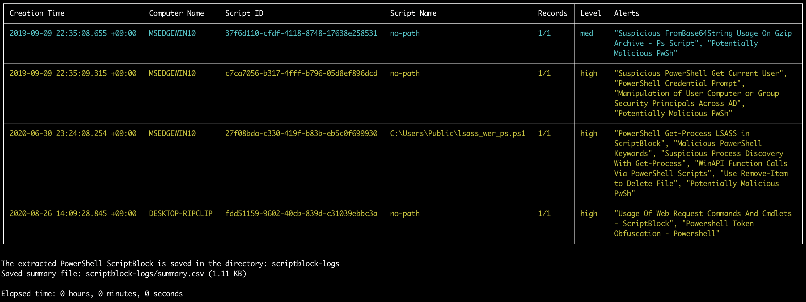

# 추출(Extract) 명령어

## `extract-scriptblocks` 명령어

PowerShell EID 4104 스크립트 블록 로그를 추출하고 재조립합니다.

> 참고: PowerShell 스크립트는 코드 구문 강조가 적용된 `.ps1` 파일로 여는 것이 가장 좋지만, 악성 코드가 실수로 실행되는 것을 방지하기 위해 `.txt` 확장자를 사용합니다.

* 입력: JSONL
* 프로파일: 모두
* 출력: 터미널 및 PowerShell 스크립트 디렉터리

필수 옵션:

- `-t, --timeline <JSONL-FILE-OR-DIR>`: Hayabusa JSONL 타임라인 파일 또는 디렉터리

옵션:

 - `-l, --level`: 최소 경고 레벨을 지정합니다 (기본값: `low`)
 - `-o, --output`: 출력 디렉터리 (기본값: `scriptblock-logs`)
 - `-q, --quiet`: 시작 배너를 표시하지 않습니다 (기본값: `false`)
 - `-s, --skipProgressBar`: 진행률 표시줄을 표시하지 않습니다 (기본값: `false`)

### `extract-scriptblocks` 명령어 예시

Hayabusa로 JSONL 타임라인을 준비합니다:

```
hayabusa.exe json-timeline -d <EVTX-DIR> -L -o timeline.jsonl -w
```

PowerShell EID 4104 스크립트 블록 로그를 `scriptblock-logs` 디렉터리로 추출합니다:

```
takajo.exe extract-scriptblocks -t ../hayabusa/timeline.jsonl
```

### `extract-scriptblocks` 스크린샷


