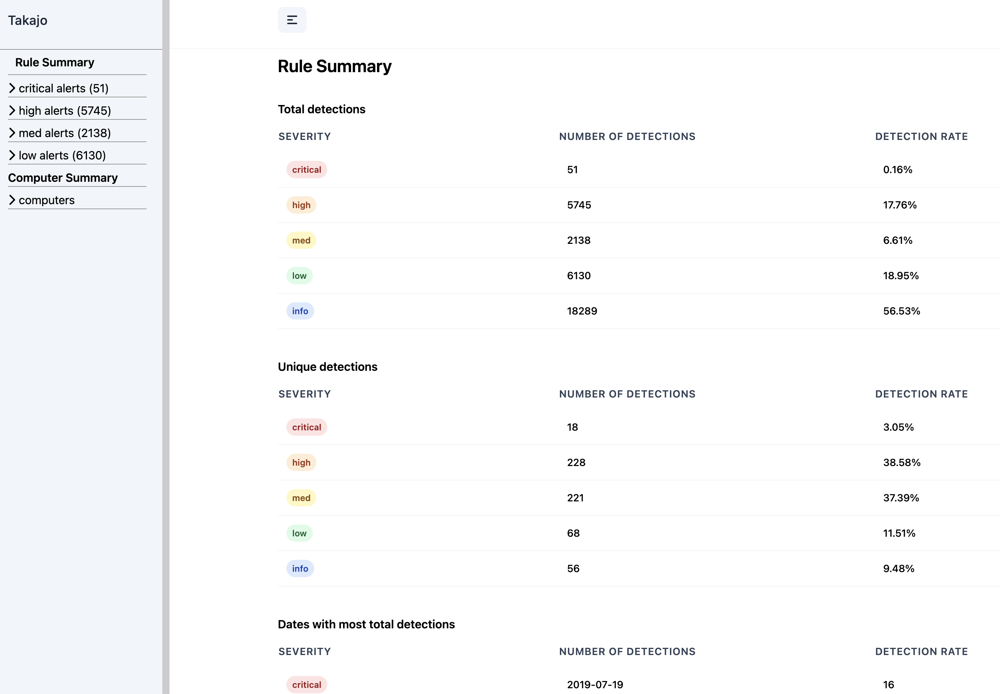
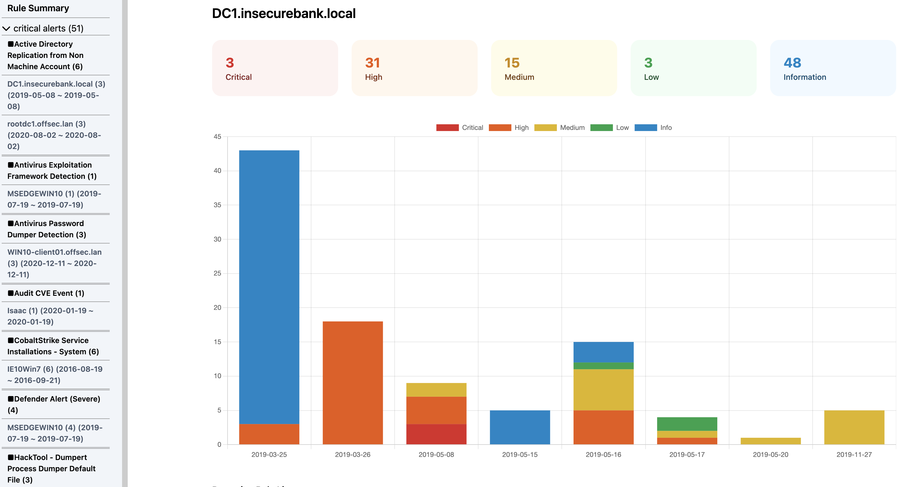
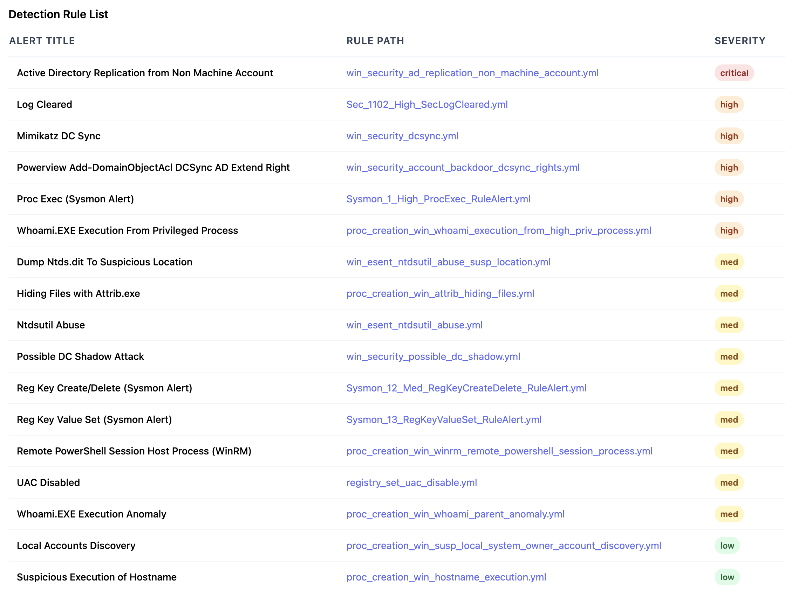
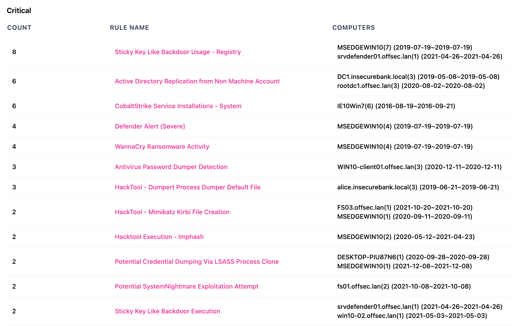
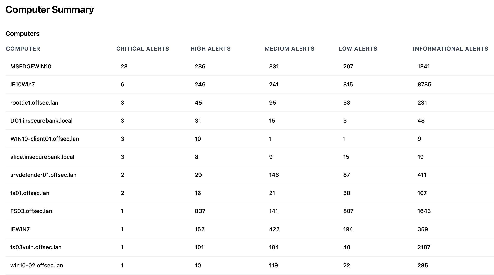
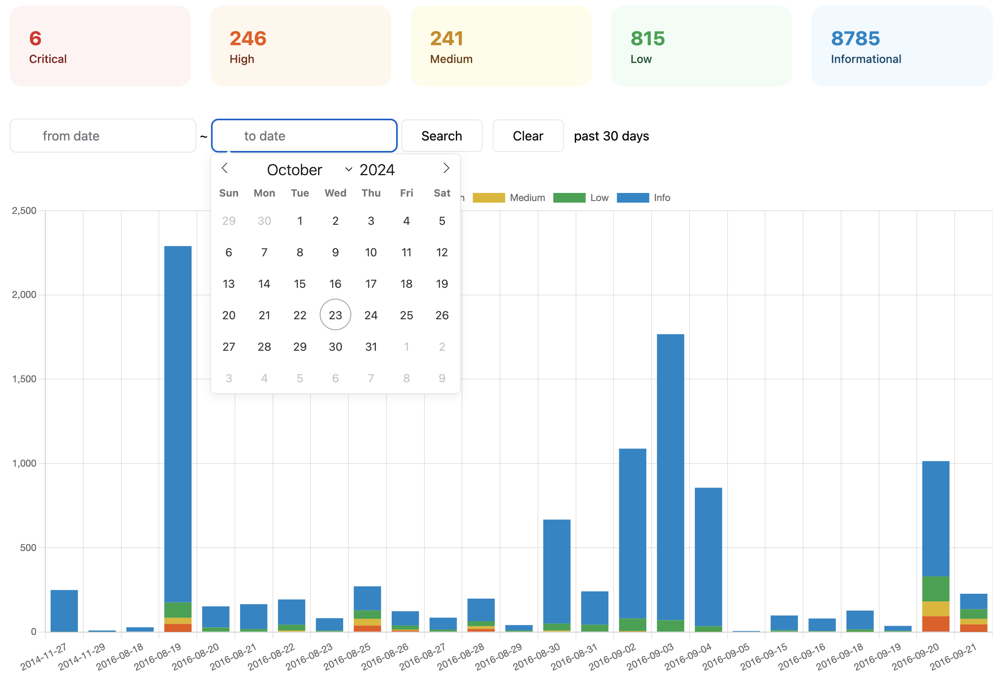
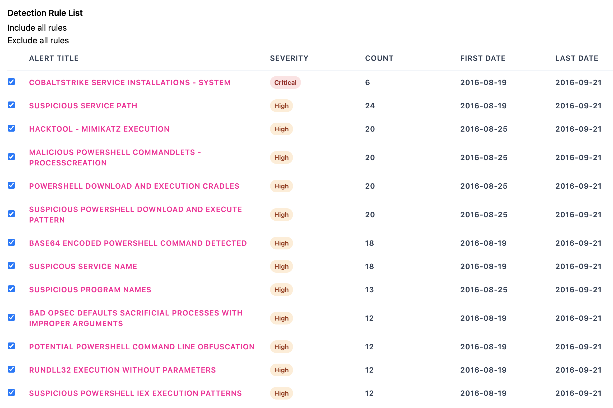

# Commandes HTML

## Commande `html-report`

Crée des rapports de synthèse HTML pour les règles et les ordinateurs ayant des détections.
Cette commande crée d'abord un fichier de base de données DuckDB indexé (par défaut) ou un fichier de base de données SQLite afin d'effectuer des recherches rapides sur les données nécessaires à la création des rapports de synthèse.

* Entrée : JSONL
* Profil : Tout profil verbeux
* Sortie : Rapports de synthèse HTML individuels basés sur le nom de l'ordinateur ainsi qu'une page principale `index.html`

Options requises :

- `-o, --output` : nom du répertoire du rapport html
- `-r, --rulepath` : chemin vers le répertoire des règles Hayabusa
- `-t, --timeline <JSONL-FILE-OR-DIR>` : fichier ou répertoire de chronologie JSONL Hayabusa

Options :

- `-C, --clobber` : écrase le fichier de base de données lors de l'enregistrement (par défaut : `false`)
- `-q, --quiet` : n'affiche pas la bannière de lancement (par défaut : `false`)
- `-s, --dboutput` : enregistre les résultats dans un fichier de base de données (par défaut : `html-report.duckdb` ou `html-report.sqlite` avec `--sqlite`)
- `--skipProgressBar` : n'affiche pas la barre de progression (par défaut : `false`)
- `--sqlite` : utilise le backend SQLite au lieu de DuckDB (par défaut : `false`)

### Exemple de commande `html-report`

Préparez la chronologie JSONL avec Hayabusa :

```
hayabusa.exe json-timeline -d <EVTX-DIR> -L -o timeline.jsonl -w -p verbose
```

ou

```
hayabusa.exe json-timeline -d <EVTX-DIR> -L -o timeline.jsonl -w -p super-verbose
```

Créez les rapports de synthèse HTML :

```
takajo.exe html-report -t ../hayabusa/hayabusa-results.jsonl -o htmlreport -r ../hayabusa/rules
```

### Captures d'écran de `html-report`

#### Synthèse des règles



#### Synthèse des ordinateurs



#### Liste des règles



## Commande `html-server`

Crée un serveur web dynamique pour consulter les rapports de synthèse HTML.
Cette commande crée d'abord un fichier de base de données DuckDB indexé (par défaut) ou un fichier de base de données SQLite afin d'effectuer des recherches rapides sur les données nécessaires à la création des rapports de synthèse.
Elle est similaire à la commande `html-report` mais est plus évolutive et permet le filtrage sur les dates et les règles.

* Entrée : JSONL
* Profil : Tout profil verbeux
* Sortie : Par défaut, écoute sur `http://localhost:8823`

Options requises :

- `-t, --timeline <JSONL-FILE-OR-DIR>` : fichier ou répertoire de chronologie JSONL Hayabusa

Options :

- `-C, --clobber` : écrase le fichier de base de données lors de l'enregistrement (par défaut : `false`)
- `-p, --port` : numéro de port du serveur web (par défaut : `8823`)
- `-q, --quiet` : n'affiche pas la bannière de lancement (par défaut : `false`)
- `-r, --rulepath` : chemin vers le répertoire des règles Hayabusa (ceci est facultatif mais nécessaire pour créer des liens corrects vers les fichiers de règles)
- `-s, --dboutput` : enregistre les résultats dans un fichier de base de données (par défaut : `html-report.duckdb` ou `html-report.sqlite` avec `--sqlite`)
- `--skipProgressBar` : n'affiche pas la barre de progression (par défaut : `false`)
- `--sqlite` : utilise le backend SQLite au lieu de DuckDB (par défaut : `false`)

### Exemple de commande `html-report`

Préparez la chronologie JSONL avec Hayabusa :

```
hayabusa.exe json-timeline -d <EVTX-DIR> -L -o timeline.jsonl -w -p verbose
```

ou

```
hayabusa.exe json-timeline -d <EVTX-DIR> -L -o timeline.jsonl -w -p super-verbose
```

Démarrez le serveur web :

```
takajo.exe html-server -t ../hayabusa/hayabusa-results.jsonl -r ../hayabusa/rules
```

### Captures d'écran de `html-server`

#### Liste des règles



#### Synthèse des ordinateurs



#### Filtrage des règles



#### Filtrage des règles


