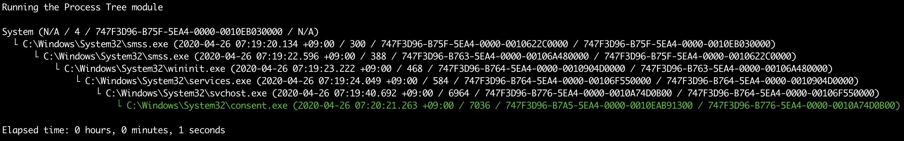

# أوامر Sysmon

## أمر `sysmon-process-tree`

إخراج شجرة العمليات لعملية معينة، مثل عملية مشبوهة أو خبيثة.

* الإدخال: JSONL
* الملف التعريفي: أي شيء باستثناء `all-field-info` و `all-field-info-verbose`
* الإخراج: الطرفية أو ملف نصي

الخيارات المطلوبة:

- `-p, --processGuid <Process GUID>`: معرّف عملية sysmon (GUID)
- `-t, --timeline <JSONL-FILE-OR-DIR>`: ملف الجدول الزمني JSONL الخاص بـ Hayabusa أو دليل يحتوي على ملفات JSONL

الخيارات:

- `-o, --output <TXT-FILE>`: ملف نصي لحفظ النتائج فيه.
- `-q, --quiet`: عدم عرض الشعار. (الافتراضي: `false`)

### أمثلة على أمر `sysmon-process-tree`

تحضير الجدول الزمني JSONL باستخدام Hayabusa:

```
hayabusa.exe json-timeline -d <EVTX-DIR> -L -o timeline.jsonl -w
```

حفظ النتائج في ملف نصي:

```
takajo.exe sysmon-process-tree -t ../hayabusa/timeline.jsonl -p "365ABB72-3D4A-5CEB-0000-0010FA93FD00" -o process-tree.txt
```

### لقطة شاشة لـ `sysmon-process-tree`


