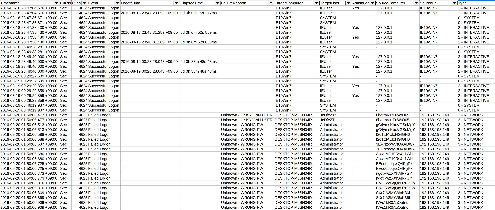
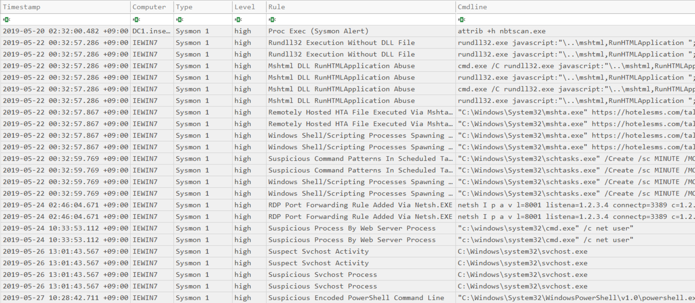

# 타임라인 명령어

## `timeline-logon` 명령어

이 명령어는 다음 로그온 이벤트에서 정보를 추출하고 필드를 정규화한 후 결과를 CSV 파일로 저장합니다:

- `4624` - 로그온 성공
- `4625` - 로그온 실패
- `4634` - 계정 로그오프
- `4647` - 사용자 시작 로그오프
- `4648` - 명시적 로그온
- `4672` - 관리자 로그온

이를 통해 측면 이동(lateral movement), 패스워드 추측/스프레이, 권한 상승 등을 더 쉽게 탐지할 수 있습니다...

* 입력: JSONL
* 프로파일: `all-field-info` 및 `all-field-info-verbose`를 제외한 모든 프로파일
* 출력: CSV

필수 옵션:

- `-o, --output <CSV-FILE>`: 결과를 저장할 CSV 파일.
- `-t, --timeline <JSONL-FILE-OR-DIR>`: Hayabusa JSONL 타임라인 파일 또는 JSONL 파일이 있는 디렉터리

옵션:

- `-c, --calculateElapsedTime`: 성공한 로그온의 경과 시간을 계산합니다. (기본값: `true`)
- `-l, --outputLogoffEvents`: 로그오프 이벤트를 별도 항목으로 출력합니다. (기본값: `false`)
- `-a, --outputAdminLogonEvents`: 관리자 로그온 이벤트를 별도 항목으로 출력합니다. (기본값: `false`)
- `-q, --quiet`: 로고를 표시하지 않습니다. (기본값: `false`)

### `timeline-logon` 명령어 예시

Hayabusa로 JSONL 타임라인 준비:

```
hayabusa.exe json-timeline -d <EVTX-DIR> -L -o timeline.jsonl -w
```

로그온 타임라인을 CSV 파일로 저장:

```
takajo.exe timeline-logon -t ../hayabusa/timeline.jsonl -o logon-timeline.csv
```

### `timeline-logon` 스크린샷



## `timeline-partition-diagnostic` 명령어

Windows 10 `Microsoft-Windows-Partition%4Diagnostic.evtx` 파일을 파싱하여 파티션 진단 이벤트의 CSV 타임라인을 생성하고, 현재 장치에 존재하는 것과 이전에 존재했던 것을 포함하여 연결된 모든 장치 및 해당 볼륨 일련 번호(Volume Serial Number)에 대한 정보를 보고합니다.
이 프로세스는 [Partition-4DiagnosticParser](https://github.com/theAtropos4n6/Partition-4DiagnosticParser) 도구를 기반으로 합니다.

* 입력: JSONL
* 프로파일: 모든 프로파일
* 출력: 터미널 또는 CSV

필수 옵션:

- `-t, --timeline <JSONL-FILE-OR-DIR>`: Hayabusa JSONL 타임라인 파일 또는 JSONL 파일이 있는 디렉터리

옵션:

- `-o, --output <CSV-FILE>`: 결과를 저장할 CSV 파일.
- `-q, --quiet`: 로고를 표시하지 않습니다. (기본값: `false`)

### `timeline-partition-diagnostic` 명령어 예시

Hayabusa로 JSONL 타임라인 준비:

```
hayabusa.exe json-timeline -d <EVTX-DIR> -L -o timeline.jsonl -w
```

연결된 장치의 CSV 타임라인 생성:

```
takajo.exe timeline-partition-diagnostic -t ../hayabusa/timeline.jsonl -o partition-diagnostic-timeline.csv
```

## `timeline-suspicious-processes` 명령어

의심스러운 프로세스의 CSV 타임라인을 생성합니다.

* 입력: JSONL
* 프로파일: `all-field-info` 및 `all-field-info-verbose`를 제외한 모든 프로파일
* 출력: 터미널 또는 CSV

필수 옵션:

- `-t, --timeline <JSONL-FILE-OR-DIR>`: Hayabusa JSONL 타임라인 파일 또는 JSONL 파일이 있는 디렉터리
- `-o, --output <CSV-FILE>`: 결과를 저장할 CSV 파일 (기본값: `stdout`)

옵션:

- `-l, --level <LEVEL>`: 최소 경고 수준을 지정합니다 (기본값: `high`)
- `-q, --quiet`: 로고를 표시하지 않습니다. (기본값: `false`)

### `timeline-suspicious-processes` 명령어 예시

Hayabusa로 JSONL 타임라인 준비:

```
hayabusa.exe json-timeline -d <EVTX-DIR> -L -o timeline.jsonl -w
```

경고 수준이 `high` 이상인 프로세스를 검색하여 화면에 결과 출력:

```
takajo.exe timeline-suspicious-processes -t ../hayabusa/timeline.jsonl
```

경고 수준이 `low` 이상인 프로세스를 검색하여 화면에 결과 출력:

```
takajo.exe timeline-suspicious-processes -t ../hayabusa/timeline.jsonl -l low
```

결과를 CSV 파일로 저장:

```
takajo.exe timeline-suspicious-processes -t ../hayabusa/timeline.jsonl -o suspicous-processes.csv
```

### `timeline-suspicious-processes` 스크린샷



## `timeline-tasks` 명령어

이 명령어는 Security 4698 이벤트에서 새로 등록된 예약 작업을 스택하고 XML 작업 내용을 파싱합니다.

* 입력: JSONL
* 프로파일: `all-field-info` 및 `all-field-info-verbose`를 제외한 모든 프로파일
* 출력: 터미널 또는 CSV 파일

필수 옵션:

- `-t, --timeline <JSONL-FILE-OR-DIR>`: Hayabusa JSONL 타임라인 파일 또는 JSONL 파일이 있는 디렉터리

옵션:

- `-o, --output <CSV-FILE>`: 결과를 저장할 CSV 파일.
- `-q, --quiet`: 로고를 표시하지 않습니다. (기본값: `false`)

### `timeline-tasks` 명령어 예시

터미널로 출력:

```
takajo.exe timeline-tasks -t ../hayabusa/timeline.jsonl
```

CSV로 저장:

```
takajo.exe timeline-tasks -t ../hayabusa/timeline.jsonl -o timeline-tasks.csv
```
