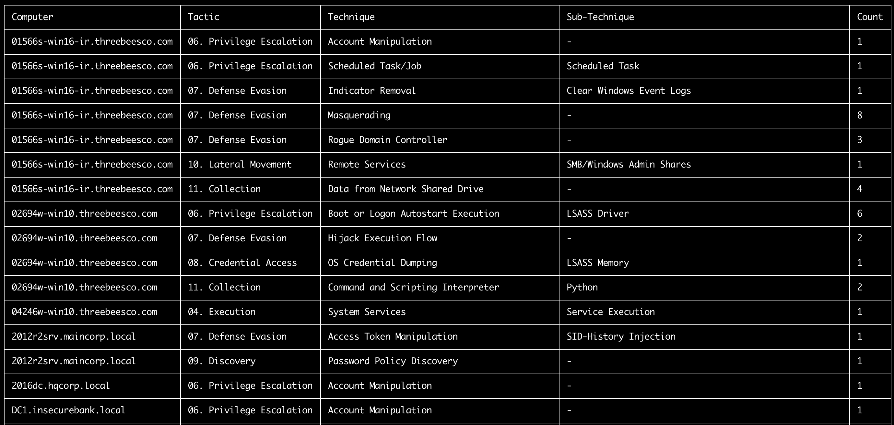
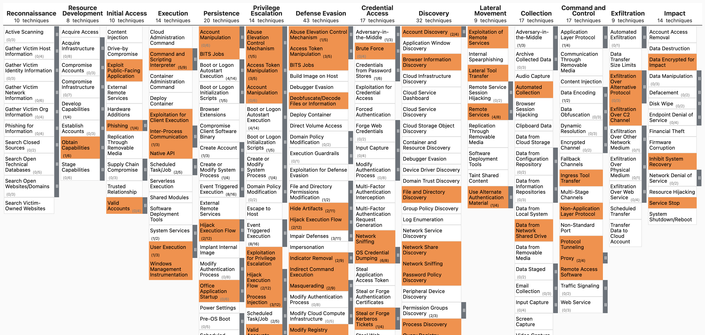

# Commandes TTP

## Commande `ttp-summary`

Cette commande résume les tactiques et techniques trouvées sur chaque ordinateur selon les TTP MITRE ATT&CK définis dans le champ `tags` des règles sigma.

* Entrée : JSONL
* Profil : Un profil qui affiche les champs `%MitreTactics%` et `%MitreTags%`. (Ex : `verbose`, `all-field-info-verbose`, `super-verbose`)
* Sortie : Terminal ou CSV

Options requises :

- `-t, --timeline <JSONL-FILE-OR-DIR>` : fichier de chronologie JSONL Hayabusa ou répertoire de fichiers JSONL

Options :

- `-o, --output <CSV-FILE>` : le fichier CSV dans lequel enregistrer les résultats.
- `-q, --quiet` : ne pas afficher le logo. (par défaut : `false`)

### Exemples de la commande `ttp-summary`

Préparer une chronologie JSONL avec Hayabusa :

```
hayabusa.exe json-timeline -d <EVTX-DIR> -L -o timeline.jsonl -w -p verbose
```

Afficher le résumé des TTP dans le terminal :

```
takajo.exe ttp-summary -t ../hayabusa/timeline.jsonl
```

Enregistrer les résultats dans un fichier CSV :

```
takajo.exe ttp-summary -t ../hayabusa/timeline.jsonl -o ttp-summary.csv
```

### Capture d'écran de `ttp-summary`



## Commande `ttp-visualize`

Cette commande extrait les TTP et crée un fichier JSON à visualiser dans [MITRE ATT&CK Navigator](https://mitre-attack.github.io/attack-navigator/).

* Entrée : JSONL
* Profil : Un profil qui affiche les champs `%MitreTactics%` et `%MitreTags%`. (Ex : `verbose`, `all-field-info-verbose`, `super-verbose`)
* Sortie : JSON

Options requises :

- `-t, --timeline <JSONL-FILE-OR-DIR>` : fichier de chronologie JSONL Hayabusa ou répertoire de fichiers JSONL

Options :

- `-o, --output <JSON-FILE>` : le fichier JSON dans lequel enregistrer les résultats. (par défaut : `mitre-ttp-heatmap.json`)
- `-q, --quiet` : ne pas afficher le logo. (par défaut : `false`)

### Exemples de la commande `ttp-visualize`

Préparer une chronologie JSONL avec Hayabusa :

```
hayabusa.exe json-timeline -d <EVTX-DIR> -L -o timeline.jsonl -w -p verbose
```

Extraire les TTP et les enregistrer dans `mitre-ttp-heatmap.json` :

```
takajo.exe ttp-visualize -t ../hayabusa/timeline.jsonl
```

Ouvrez [https://mitre-attack.github.io/attack-navigator/](https://mitre-attack.github.io/attack-navigator/), cliquez sur `Open Existing Layer` et téléversez le fichier JSON enregistré.

### Capture d'écran de `ttp-visualize`



## Commande `ttp-visualize-sigma`

Cette commande extrait les TTP de Sigma et crée un fichier JSON à visualiser dans [MITRE ATT&CK Navigator](https://mitre-attack.github.io/attack-navigator/).

* Entrée : Répertoire de règles Sigma
* Sortie : JSON

Options requises :

- `-r, --ruleDir <SIGMA-DIR>` : répertoire de règles Sigma

Options :

- `-o, --output <JSON-FILE>` : le fichier JSON dans lequel enregistrer les résultats. (par défaut : `mitre-attack-navigator.json`)
- `-q, --quiet` : ne pas afficher le logo. (par défaut : `false`)

### Exemples de la commande `ttp-visualize-sigma`

Cloner le dépôt Sigma :

```
git clone https://github.com/SigmaHQ/sigma.git
```

Extraire les TTP de Sigma et les enregistrer dans `mitre-attack-navigator.json` :

```
takajo.exe ttp-visualize-sigma -r ../sigma
```
